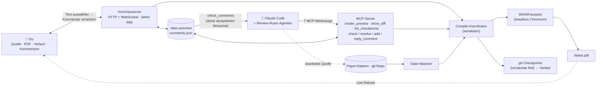

# MagicTeX — LaTeX-Editor für KI-Agenten

<!-- badges -->
[](https://www.npmjs.com/package/magictex-mcp)
[](https://registry.modelcontextprotocol.io)
[](https://github.com/ZoeLinUTS/MagicTeX-mcp/actions/workflows/ci.yml)
[](https://github.com/ZoeLinUTS/MagicTeX-mcp/stargazers)
[](https://github.com/ZoeLinUTS/MagicTeX-mcp/commits/main)
[](../../LICENSE)
[](https://github.com/sponsors/ZoeLinUTS)

[English](../../README.md) · [简体中文](README.zh-CN.md) · [日本語](README.ja.md) · [한국어](README.ko.md) · [Español](README.es.md) · [Français](README.fr.md) · **Deutsch** · [Português](README.pt.md)


**MagicTeX** ist ein **LaTeX-Editor für KI-Agenten** — ein Overleaf-artiger
**Ein-Fenster-Arbeitsbereich** für Claude Code, bereitgestellt über einen MCP-Server, **ohne
lokale TeX-Installation und ohne Overleaf-Konto**: Live-PDF-Vorschau, ein Quellcode-Editor mit
**Visual-Modus (WYSIWYG)**, Änderungsverlauf und **Kommentare, die du im gerenderten PDF
verankerst und die zu Bearbeitungsanweisungen für den Agenten werden**. (npm-Paket:
`magictex-mcp`.)

Kompiliert wird mit einer WASM-TeX-Live-2026-Engine
([texlyre-busytex](https://github.com/TeXlyre/texlyre-busytex)) in einem Headless-Browser — es
gibt also nichts Mehrere-GB-Großes zu installieren, nur einen einmaligen WASM-Asset-Download.

## Vor der Installation ansehen

Unter **[zoelin.dev/tools/magictex](https://zoelin.dev/tools/magictex)** gibt es einen
geführten Durchlauf der Kommentar-→-Agent-Schleife, gebaut aus echter Tool-Ausgabe. Es ist
ein Replay, keine gehostete Instanz — die TeX-Engine ist ein einmaliger Download von
~650 MB, und die Agent-Hälfte ist Claude selbst. MagicTeX läuft daher neben deinem Projekt,
nicht in einer Webseite.

## Der Arbeitsbereich

Ein einziges Browserfenster (inspiriert von Typsts Ein-Flächen-Editor und LiquidTexts
verankerten Anmerkungen):

```
┌──────────────────────────────────────────────────────────────┐
│  ✓ aktuell · 13 Seiten          .zip exportieren · PDF laden │
├────────────┬──────────────────────────────┬──────────────────┤
│ Quelle /   │         PDF (live)           │   Kommentare     │
│ Verlauf    │  Text wählen → 💬 Kommentar  │  akzeptierte →   │
│  Editor,   │  Markierungen bleiben sitzen │  Claude soll sie │
│  Zeitleiste│  lädt bei jeder Änderung neu │  erledigen → ✓   │
│  + Diffs   │                              │                  │
└────────────┴──────────────────────────────┴──────────────────┘
```

- **Kommentar-→-Agent-Schleife (der Kern).** Prüfe das *gerenderte* Dokument wie eine
  Papierkorrektur: Text auswählen, Kommentar hinzufügen. Sag dann Claude „address my comments“ —
  es holt sie über `check_comments` als **lokalisierte Aufgaben** (Seite + Zitat + die
  Quell-`Datei:Zeile` + deine Bitte), bearbeitet die Quelle und löst jede Karte mit einer Notiz.
- **Editierbares Quellpanel + Dateibaum.** CodeMirror-LaTeX-Editor, Overleaf-artiger Dateibaum
  (Ordner, Neu/Umbenennen/Löschen, Datei wechseln). Ctrl+S kompiliert neu.
- **Visual-Modus (WYSIWYG).** Überschriften, Fett, Kursiv sowie `$…$`- und
  `\begin{equation}`-Formeln werden an Ort und Stelle gerendert; beim Hovern erscheint das
  Original-LaTeX zum Bearbeiten.
- **Review-Workflow (Reviewer → menschliche Freigabe → Autor).** Ein Reviewer-/Defender-Agent
  postet Kommentare via `add_comment`; du **akzeptierst/lehnst ab** (oder aktivierst den
  Copilot-Modus *Auto-Akzeptieren*); eine Autor-Schleife löst die akzeptierten.
- **Änderungsverlauf.** Jede erfolgreiche Kompilierung wird in eine **versteckte git-Ref**
  gespeichert — deine Branches und dein `git log` bleiben unberührt.
- **Speichern und Neukompilieren sind zweierlei.** Der eingebaute Editor speichert alle 30 s
  automatisch, ohne neu zu kompilieren; **Strg+S / Speichern / Recompile** bauen das PDF auf
  Zuruf neu. (Mit **⚡ Live** wird beim Tippen neu kompiliert.) Dein eigener Editor und Claudes
  Änderungen kompilieren weiterhin automatisch über den Watcher.
- **Live-Reload.** Ein Datei-Watcher kompiliert bei jedem Speichern neu — ob Claude, der
  eingebaute Editor oder dein externer Editor die Änderung gemacht hat.
- **Nach Overleaf kommen.** **PDF herunterladen**, **.zip exportieren** (nur die Build-Eingaben)
  und ein **Open in Overleaf**-Link mit einem Klick für öffentliche GitHub-Repos; die
  Synchronisation über die Premium-Git-Bridge ist ein dokumentiertes `git push`. Siehe
  [`USER-GUIDE.de.md`](USER-GUIDE.de.md).
- **Echte Projekte.** Erkennt die Hauptdatei, sammelt mehrdateiliges `\input`/`\include`,
  `.bib`, `.cls`/`.sty`/`.bst` aus dem Repo und Abbildungen, führt BibTeX aus und wiederholt bei
  Bedarf; häufig fehlende Pakete werden automatisch ergänzt.
- **Compile-Backend.** Nutzt dein lokales **latexmk**, wenn vorhanden — volle Pakettreue,
  Ausgabe wie bei Overleaf — sonst das mitgelieferte **WASM**-TeX-Live ganz ohne Installation.
  Mit `backend: "system"` / `"wasm"` erzwingbar. Jede Kompilierung nennt, welches lief.
- **Dokumentklassen.** `IEEEtran` liegt bei, denn im WASM-TeX-Live steckt keine einzige
  Konferenzklasse, und eine fehlende Klasse lässt sich nicht umgehen wie ein Paket.
  Konferenzvorlagen (NeurIPS, ICML, CVPR, ACL, AAAI …) haben keine weiterverteilbare Lizenz —
  lege die `.cls` aus dem Autorenkit neben deine Quelle, sie wird automatisch gefunden.
- **MCP-Werkzeuge:** `render_preview` (kompilieren und Arbeitsbereich öffnen),
  `check_comments` / `resolve_comment` / `add_comment` / `reply_to_comment` (die Review-Schleife),
  `show_diff` (Diff nebeneinander als Bild — nützlich bei bildfähigen Clients).
- **Verwertbare Fehler.** Fehlgeschlagene Kompilierungen liefern geparste
  `{file, line, message}`-Fehler, damit Claude sich selbst korrigieren kann, und zeigen sie im
  Arbeitsbereich an.

## Einrichtung

MagicTeX liegt auf npm als [`magictex-mcp`](https://www.npmjs.com/package/magictex-mcp) und
ist in der [offiziellen MCP-Registry](https://registry.modelcontextprotocol.io) als
**`io.github.ZoeLinUTS/magictex`** eingetragen — jeder Client, der die Registry liest, findet
es also. Nichts zu klonen, kein TeX zu installieren; `npx` holt es beim ersten Mal.

1. Füge es zur `.mcp.json` deines Projekts hinzu (siehe [`.mcp.json.example`](../../.mcp.json.example)):

   ```json
   {
     "mcpServers": {
       "magictex": { "command": "npx", "args": ["-y", "magictex-mcp"] }
     }
   }
   ```

2. **Starte Claude Code neu** (oder `/mcp` neu verbinden), damit der Server geladen wird.
3. Bitte Claude „render a preview of this paper“ — beim ersten Mal werden die WASM-TeX-Live-
   Assets (~650 MB, einmalig) heruntergeladen, kompiliert und die Live-Vorschau geöffnet.
   Spätere Änderungen laden sie automatisch neu.

   Für lokale Entwicklung aus einem Klon stattdessen auf die Quelle zeigen:
   `"command": "npx", "args": ["tsx", "/absoluter/pfad/magictex-mcp/src/server.ts"]`

Die WASM-Assets liegen **nicht** in diesem Repository. Sie werden beim ersten Lauf in einen
Cache **pro Benutzer** geholt — `~/Library/Caches/magictex` unter macOS,
`$XDG_CACHE_HOME/magictex` unter Linux, `%LOCALAPPDATA%\magictex` unter Windows — sodass ein
Update von MagicTeX sie nicht erneut lädt und ein Checkout, eine globale Installation und ein
`npx`-Lauf sich eine Kopie teilen. Mit `MAGICTEX_ASSETS_DIR` an einen anderen Ort legen. Zum
Vorabladen: `npx texlyre-busytex download-assets <dieses Verzeichnis>`.

## Als Claude-Code-Plugin installieren (Slash-Befehle)

Für weniger Tippen installiere MagicTeX als Plugin — eine Installation gibt dir den MCP-Server
**und** die Slash-Befehle:

```
/plugin marketplace add ZoeLinUTS/MagicTeX-mcp
/plugin install magictex
```

- **`/magic-latex`** — kompilieren und den Arbeitsbereich öffnen.
- **`/ai-review [skill]`** — das Paper mit einer Skill prüfen (Standard
  `academic-paper-revision`; jeder Name geht) und Kommentare zum Akzeptieren/Ablehnen posten.
- **`/address-comments`** — deine akzeptierten Kommentare lösen (`/loop 60s /address-comments`).
- ⚡ **`/ultra-agents [skill] [depth]`** — vollautonomer Modus: prüfen, automatisch
  akzeptieren, korrigieren, wiederholen — bis zu `depth` Runden (Standard 2),
  vorzeitiger Stopp, sobald eine Runde nichts Neues findet. Keine Freigabe zwischen
  den Runden — das ist der Sinn und das Risiko zugleich. Über `depth = 5` wird vor
  dem Start eine Bestätigung verlangt. Endet mit einer Zusammenfassung (was
  angemerkt, was geändert wurde, welche Checkpoints anzuschauen sind) — jede Runde
  bleibt ein normaler, rückgängig machbarer Checkpoint.

### Ein Befehl pro Tool

Jedes MCP-Tool hat auch einen Slash-Befehl mit **demselben Namen**, du kannst also jeden einzelnen Schritt per Tool-Namen auslösen. Die Regel zum Weitergeben: *das Tool heißt `X` → tippe `/X`*.

| Das tippen | Führt Tool aus | Was es tut |
| --- | --- | --- |
| `/render_preview` | `render_preview` | Kompiliert das Paper und öffnet/aktualisiert die Live-Vorschau. |
| `/check_comments` | `check_comments` | Listet deine akzeptierten Kommentare als Anweisungen (noch keine Änderung). |
| `/resolve_comment [id] [Notiz]` | `resolve_comment` | Markiert einen Kommentar nach der Änderung als erledigt; wird **grün** zur Prüfung. |
| `/add_comment ["Zitat"] [Notiz]` | `add_comment` | Verankert einen Kommentar an einer Stelle zum Annehmen/Ablehnen. |
| `/reply_to_comment [id] [Text]` | `reply_to_comment` | Fügt eine Thread-Antwort zu einem Kommentar hinzu. |
| `/show_diff [checkpoint]` | `show_diff` | Nebeneinander-Diff als Bild (aktuelle Änderungen oder ein Checkpoint). |
| `/list_checkpoints [limit]` | `list_checkpoints` | Letzte Checkpoints mit sha, neueste zuerst — um einen an `/show_diff` zu übergeben. |

Du musst sie nie tippen – normale Sprache funktioniert auch (*„zeig eine Vorschau“*, *„bearbeite meine Kommentare“*). Die Befehle sind nur eine schnelle, gut vermittelbare Kurzform.

> Das Plugin bringt den MCP-Server (`npx magictex-mcp`) mit — das Plugin zu installieren
> genügt also. Die `.mcp.json` oben ist die Alternative, wenn du lieber kein Plugin
> installierst. Die Slash-Befehle funktionieren in beiden Fällen.

## Tools (Werkzeuge)

Die MCP-Schnittstelle, für jeden Client, der MCP spricht. (In Claude Code genügen normale Sprache oder die Slash-Befehle oben — das hier sind die Werkzeuge darunter.)

| Tool | Parameter | Was es tut |
| ---- | ---- | ---- |
| `render_preview` | `mainFile?` · `engine?` (`pdflatex` \| `xelatex` \| `lualatex`, Standard `xelatex`) · `backend?` (`wasm` \| `system` \| `auto`, Standard `auto` — lokales latexmk falls installiert, sonst die gebündelte WASM-Engine) | Kompiliert das Projekt und öffnet/aktualisiert den Live-Arbeitsbereich. Ohne Angabe wird die Hauptdatei per `\documentclass`-Suche erkannt. |
| `check_comments` | `includeResolved?` (Standard `false`) | Gibt akzeptierte Kommentare als **lokalisierte Aufgaben** zurück: Seite, Zitat, die Quell-`Datei:Zeile` und deine Bitte. Reviewer-Vorschläge, die noch auf deine Entscheidung warten, werden gemeldet, aber nicht als Arbeit zurückgegeben. |
| `add_comment` | `quote` · `comment` · `role?` (`reviewer` \| `defender`) · `page?` · `accepted?` | Verankert einen Kommentar an einer Textstelle. Wird als **Vorschlag** gepostet, der auf dein Annehmen/Ablehnen wartet — außer `accepted` ist gesetzt; genau dieses Flag macht den autonomen Modus autonom. |
| `resolve_comment` | `id` · `note` | Markiert einen Kommentar nach der Änderung als erledigt, mit einer Zeile dazu, was sich geändert hat. Er wird im Arbeitsbereich **grün** und wartet auf deine Prüfung. |
| `reply_to_comment` | `id` · `text` · `role?` (`author` \| `reviewer` \| `defender`) | Fügt eine Thread-Antwort hinzu, damit eine Meinungsverschiedenheit am Kommentar statt im Chat geklärt wird. |
| `show_diff` | `checkpoint?` | Rendert ein Nebeneinander-Diff **als Bild**, inline im Gespräch. Standardmäßig die nicht committeten Änderungen; mit einem Checkpoint-Sha eine gespeicherte Fassung. |
| `list_checkpoints` | `limit?` (Standard 10, max. 50) | Letzte Checkpoints mit sha, neueste zuerst — um zu finden, welchen du an `show_diff` übergibst. |

**Die Aushängeschilder sind *auf* diesen Werkzeugen gebaut, nicht Teil davon.** `/magic-latex`, `/ai-review`, `/address-comments` und ⚡ `/ultra-agents` sind **Plugin-Befehle** von Claude Code, die die Werkzeuge oben orchestrieren — `/ultra-agents` verkettet Prüfen → automatisch annehmen → korrigieren über so viele Runden, wie du erlaubst, und ist der Grund, warum `add_comment` ein `accepted`-Flag hat. Sie gehören nicht zur MCP-Schnittstelle: ein anderer MCP-Client sieht nur diese sieben. Siehe den Plugin-Abschnitt oben und [docs/AGENT-LOOP.de.md](AGENT-LOOP.de.md).

## So sieht es im Terminal aus

Das hier sind echte Werkzeugausgaben, wörtlich aus einem realen Lauf gegen das Beispielpaper
übernommen — nichts nachgestellt. Genau das siehst du in Claude Code, während der
Browser-Arbeitsbereich (Screenshot oben) denselben Zustand live spiegelt.

Du tippst:
```
/magic-latex
```
Claude ruft `render_preview` auf und antwortet:
```
✓ Compiled main.tex with xelatex in 1900ms — 2 files. Workspace (live preview,
source editor, history, PDF comments — auto-reloads on edits):
http://127.0.0.1:52042/app
```

Du (oder eine Reviewer-Skill) hinterlässt einen Kommentar und fragst dann, was ansteht.
Claude ruft `check_comments` auf:
```
1 accepted comment — edit each at its source location per the instruction, then
call resolve_comment with its id and a one-line note:

[id: 2fce9e3c8b5f] p.1 — "Sorting widgets efficiently is a long-standing problem"
  ↳ source: main.tex:15
  → Tighten this opening sentence.

(1 reviewer suggestion still awaits the human's accept in the workspace — not
actionable yet.)
```
Claude macht die Änderung und ruft `resolve_comment` auf:
```
✓ Resolved comment 2fce9e3c8b5f ("Sorting widgets efficiently is a long-standing
problem…") — the card now shows: Rewrote the opening sentence.
```
Fragst du erneut, ist die Warteschlange der akzeptierten leer — es bleibt nur der noch nicht
akzeptierte Vorschlag, der auf dich wartet:
```
No accepted comments. (2 already resolved.)

(1 reviewer suggestion still awaits the human's accept in the workspace — not
actionable yet.)
```

## Wie es funktioniert

```
Claude bearbeitet .tex ─┐
 Datei-Watcher ─────────┼─▶ Koordinator ─▶ headless Chromium ─▶ WASM TeX ─▶ PDF
 render_preview ────────┘   (serialisiert)  (Engine-Host)                 │
                                                                          ▼
      dein Arbeitsbereich (/app)  ◀── WebSocket "reload" ◀── lokaler HTTP-Server
      Quelle · PDF · Verlauf · Kommentare       (liefert /app und /latest.pdf)
```

Die WASM-Engines brauchen DOM/Worker-Globals, also hält der Server ein verstecktes headless
Chromium als Compile-Arbeiter; der Arbeitsbereich, den *du* öffnest, ist eine schlanke
React-+-pdf.js-App ganz ohne WASM. Siehe [`ARCHITECTURE.de.md`](ARCHITECTURE.de.md).



Beide Eingänge — du im Arbeitsbereich, Agenten über die 7 MCP-Werkzeuge — treffen sich am selben
Koordinator, demselben Kommentarspeicher und derselben git-Historie. Du arbeitest am
*gerenderten Dokument* (Kommentar verankern); Claude arbeitet an der *Quelle* (liest deine
Kommentare über `check_comments`, bearbeitet, `resolve_comment`). Dieser gemeinsame Unterbau
ist es, der die Kommentarschleife, den Review-Workflow und eine nachvollziehbare Historie
überhaupt möglich macht.

## Voraussetzungen

- Node 20.19+ (die Untergrenze, die `chokidar` und `playwright` tatsächlich brauchen; der
  Server prüft das beim Start und sagt es klar und verweigert den Start, statt einen Fehler zu
  werfen, in dem Node gar nicht vorkommt)
- Playwrights Chromium (wird automatisch installiert; ~150–300 MB) — oder so konfigurieren, dass
  dein installiertes Chrome wiederverwendet wird.
- ~650 MB Plattenplatz für die einmaligen WASM-TeX-Live-Assets — beim ersten Lauf wird alles
  geholt, in drei Paketsätzen (basic 87 MB, recommended 190 MB, extra 324 MB, plus 31 MB
  Engine). Ein normales Paper *lädt* nur den basic-Satz; die beiden größeren liegen auf der
  Platte, bis etwas sie braucht. Der Cache ist pro Benutzer, nicht pro Installation — ein Update
  von MagicTeX lädt sie also nicht erneut. Den Ort änderst du mit `MAGICTEX_ASSETS_DIR`.
- **Eine lokale TeX-Distribution ist optional.** Wann sie zählt, steht unten.

### Brauche ich eine lokale TeX-Distribution?

Nein — die gebündelte WASM-Engine kompiliert ohne jede Installation, das ist der
Sinn der Sache. Sie enthält aber nur eine *Teilmenge* von TeX Live: `svg`, die
meisten Konferenz-Dokumentklassen und diverse seltenere Pakete fehlen. Fehlt
eines, wirst du darauf hingewiesen, statt ein still falsches PDF zu bekommen.

Installiere eine Distribution, wenn die Ausgabe exakt der von Overleaf
entsprechen soll. MagicTeX findet sie von allein — ohne Konfiguration:

| | |
|---|---|
| macOS | [MacTeX](https://tug.org/mactex/) |
| Linux | `texlive-full` |
| Windows | [TeX Live](https://tug.org/texlive/), or [MiKTeX](https://miktex.org/) **plus** [Strawberry Perl](https://strawberryperl.com/) |

> `latexmk` ist das, wonach MagicTeX im `PATH` sucht, aber man installiert es
> nicht einzeln — es ist ein Treiberskript aus den obigen Distributionen. Prüfe
> mit **`latexmk -version`**, nicht mit `which latexmk`: `latexmk` ist ein
> Perl-Skript, und MiKTeX legt `latexmk.exe` in den `PATH`, ohne ein Perl
> mitzuliefern — die Datei wird also gefunden und kann trotzdem nicht laufen.
> Unter macOS ggf. vorher `eval "$(/usr/libexec/path_helper)"` oder ein neues
> Terminal.

Jeder Lauf nennt die verwendete Variante — `xelatex · system` oder `xelatex · wasm`.

## Entwicklung

```bash
npm install
npm run typecheck    # tsc für Server und UI
npm run build:ui     # baut den React-Arbeitsbereich nach ui/dist
npm test             # die Unit-Suite — ohne Engine, ohne Browser, Sekunden
npm start            # startet den Server auf stdio (für einen manuellen MCP-Client)
```

Zwei Ebenen, mit Absicht. `npm test` deckt den Kommentarspeicher, das Anker-Matching, die
Zeilen- und Spaltengeometrie, das Verlaufs-Repository, die Asset-Pfade, die Klassifikation des
Compile-Logs, das Herunterfahren des Vorschauservers und einen E2E des MCP-Ablaufs ab — alles
ohne Browser und ohne TeX-Engine, also schnell und deterministisch. Die CI
(`.github/workflows/ci.yml`) führt Typecheck + UI-Build + diese Suite auf Node 20 und 22 bei
jedem Push und jedem Pull Request aus.

Was ein Unit-Test **strukturell nicht sehen kann** — die Geometrie der Markierungen bei
mehreren Zoomstufen, was ein gescheitertes Rendering dem Lesenden tatsächlich sagt, ob beim
Beenden der Server wirklich schließt und offene Fenster gewarnt werden — liegt in
`scripts/smoke-*.mjs` und läuft gegen einen echten Browser und eine echte Kompilierung in
`.github/workflows/smoke-macos.yml`. Jedes davon existiert, weil **etwas kaputt ausgeliefert
wurde, während die Unit-Suite grün war**. Halte beide grün und ergänze Abdeckung mit deinen
Änderungen.

## Dokumentation

- [**Benutzerhandbuch**](USER-GUIDE.de.md) — täglicher Einsatz, die Kommentar-Schleife,
  Visual-Modus, der Dateibaum, dein Paper nach Overleaf bringen, Paketabdeckung.
- [**Die Agent-Schleife**](AGENT-LOOP.de.md) — Kommentare als Auslöser, unbeaufsichtigt mit `/loop`,
  der Ablauf Reviewer → Freigabe → Resolver, und ⚡ `/ultra-agents`.
- [**Roadmap**](ROADMAP.de.md) — was für gleichzeitige Agents fertig ist und was echtes paralleles
  Multi-Agent-Bearbeiten noch braucht.
- [**Architektur**](ARCHITECTURE.de.md) — warum ein Headless-Browser, was jedes Modul tut, der
  Kompilierungsablauf.

Alle vier sind in dieselben 8 Sprachen übersetzt wie dieses README — jede Seite hat oben ihre
eigene Sprachauswahl.

## Roadmap

Mehrere Claude-Code-Sitzungen können bereits gleichzeitig am selben Projekt arbeiten, ohne
Kommentare oder die Checkpoint-Historie zu beschädigen (siehe
[`ROADMAP.de.md`](ROADMAP.de.md)) — echtes paralleles Multi-Agent-Editing (Reviewer / Autor /
Defender auf eigenen git-Branches, danach zusammengeführt) ist der nächste Meilenstein.

## Dieses Projekt unterstützen

MagicTeX ist frei und quelloffen (AGPL-3.0). Wenn es dir Zeit bei deinen Papern spart, erwäge
bitte, **[das Projekt zu unterstützen](https://github.com/sponsors/ZoeLinUTS)**. Ein ⭐ auf dem
Repo hilft ebenfalls.

## Danksagungen

MagicTeX wird von [Zoe Lin](https://zoelin.dev) geschrieben und gepflegt, gebaut mit **[Claude Code](https://claude.com/claude-code)**.

Dank an **David Turnbull**, der mir die Geschichte erzählte, wie Knuth zehn Jahre lang
seinen eigenen Schriftsetzer baute, statt hinzunehmen, wie sein Buch aussah — die
Geschichte, mit der dieses Projekt bis heute ringt. Und an die Betreuer von [`texlyre-busytex`](https://github.com/TeXlyre/texlyre-busytex),
ohne deren WASM-TeX-Live hier lokal überhaupt nichts liefe.

## Lizenz

[AGPL-3.0-or-later](../../LICENSE) — wie die Engine `texlyre-busytex`, auf der es aufbaut.
Siehe [`THIRD_PARTY_NOTICES.md`](../../THIRD_PARTY_NOTICES.md).
