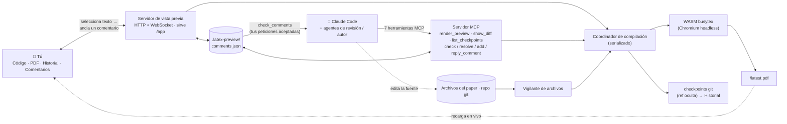

# MagicTeX — Editor de LaTeX para agentes de IA

<!-- badges -->
[](https://www.npmjs.com/package/magictex-mcp)
[](https://registry.modelcontextprotocol.io)
[](https://github.com/ZoeLinUTS/MagicTeX-mcp/actions/workflows/ci.yml)
[](https://github.com/ZoeLinUTS/MagicTeX-mcp/stargazers)
[](https://github.com/ZoeLinUTS/MagicTeX-mcp/commits/main)
[](../../LICENSE)
[](https://github.com/sponsors/ZoeLinUTS)

[English](../../README.md) · [简体中文](README.zh-CN.md) · [日本語](README.ja.md) · [한국어](README.ko.md) · **Español** · [Français](README.fr.md) · [Deutsch](README.de.md) · [Português](README.pt.md)


**MagicTeX** es un **editor de LaTeX creado para agentes de IA**: un espacio de trabajo de
**una sola ventana** al estilo Overleaf para Claude Code, servido por un servidor MCP, **sin
instalación local de TeX ni cuenta de Overleaf**: vista previa del PDF en vivo, un editor de
código con **modo Visual (WYSIWYG)**, historial de cambios y **comentarios que anclas en el
PDF renderizado y que se convierten en instrucciones de edición para el agente**. (paquete
npm: `magictex-mcp`.)

Compila con un motor WASM TeX Live 2026
([texlyre-busytex](https://github.com/TeXlyre/texlyre-busytex)) que corre dentro de un
navegador headless, así que no hay nada de varios GB que instalar — solo una descarga única
de recursos WASM.

## Véalo antes de instalar

En **[zoelin.dev/tools/magictex](https://zoelin.dev/tools/magictex)** hay un recorrido guiado
del bucle comentario → agente, construido con salida real de la herramienta. Es una
repetición, no una instancia alojada: el motor TeX es una descarga única de ~650 MB y la
mitad del agente es el propio Claude, así que MagicTeX corre junto a tu proyecto, no en una
página web.

## El espacio de trabajo

Una sola ventana del navegador (inspirada en la edición de una superficie de Typst y las
anotaciones ancladas de LiquidText):

```
┌──────────────────────────────────────────────────────────────┐
│  ✓ al día · 13 páginas          Exportar .zip · Descargar PDF│
├────────────┬──────────────────────────────┬──────────────────┤
│ Código /   │        PDF (en vivo)         │   Comentarios    │
│ Historial  │  selecciona texto → 💬       │  aceptados → que │
│  editor,   │  los resaltados no se mueven │  Claude los      │
│  línea de  │  se recarga en cada edición  │  atienda → ✓     │
│  tiempo    │                              │                  │
└────────────┴──────────────────────────────┴──────────────────┘
```

- **Bucle comentario → agente (lo esencial).** Revisa el documento *renderizado* como quien
  corrige una copia impresa: selecciona texto y añade un comentario. Luego dile a Claude
  «address my comments» — los obtiene con `check_comments` como **tareas localizadas** (página
  + cita + el `archivo:línea` de origen + tu petición), edita la fuente y resuelve cada tarjeta
  con una nota.
- **Panel de código editable + árbol de archivos.** Editor LaTeX CodeMirror, árbol de archivos
  al estilo Overleaf (carpetas, nuevo/renombrar/eliminar, cambiar de archivo). Ctrl+S recompila.
- **Modo Visual (WYSIWYG).** Títulos, negrita, cursiva y fórmulas `$…$` y `\begin{equation}` se
  renderizan en su lugar; al pasar el cursor se muestra el LaTeX original para editar.
- **Flujo de revisión (revisor → visto bueno humano → autor).** Un agente revisor/defensor
  publica comentarios con `add_comment`; tú **aceptas/rechazas** (o activas el modo copiloto de
  *auto-aceptar*); un bucle autor resuelve los aceptados.
- **Historial de cambios.** Cada compilación exitosa se guarda en un **ref oculto de git**, sin
  tocar tus ramas ni tu `git log`.
- **Guardar y recompilar son cosas distintas.** El editor integrado guarda solo cada 30 s sin
  recompilar; **Ctrl+S / Guardar / Recompilar** rehacen el PDF cuando tú quieras. (Activa
  **⚡ Live** para recompilar mientras escribes.) Tu propio editor y las ediciones de Claude
  siguen recompilando solas a través del vigilante.
- **Recarga en vivo.** Un vigilante de archivos recompila en cada guardado — lo edite Claude,
  el editor integrado o tu editor externo.
- **Llegar a Overleaf.** **Descargar PDF**, **Exportar .zip** (solo las entradas de compilación)
  y un enlace **Open in Overleaf** de un clic para repos públicos de GitHub; la sincronización
  con el puente Git de Premium es un `git push` documentado. Ver
  [`USER-GUIDE.es.md`](USER-GUIDE.es.md).
- **Proyectos reales.** Detecta el archivo principal, reúne `\input`/`\include` en varios
  archivos, `.bib`, `.cls`/`.sty`/`.bst` del repo y figuras, ejecuta BibTeX y lo repite cuando
  hace falta; los paquetes que suelen faltar se añaden automáticamente.
- **Backend de compilación.** Usa tu **latexmk** local si lo tienes — fidelidad total de
  paquetes, salida igual a la de Overleaf — y el **WASM** TeX Live incluido, sin instalar nada,
  si no. Fuérzalo con `backend: "system"` / `"wasm"`. Cada compilación dice cuál se usó.
- **Clases de documento.** `IEEEtran` viene incluida, porque en el WASM TeX Live no hay ninguna
  clase de congreso y una clase que falta no se puede sortear como un paquete. Las plantillas de
  congresos (NeurIPS, ICML, CVPR, ACL, AAAI …) no tienen licencia redistribuible, así que pon el
  `.cls` del kit de autor junto a tu fuente — se detecta solo.
- **Herramientas MCP:** `render_preview` (compilar y abrir el espacio de trabajo),
  `check_comments` / `resolve_comment` / `add_comment` / `reply_to_comment` (el ciclo de
  revisión), `show_diff` (diff lado a lado como imagen — útil en clientes con imágenes).
- **Errores accionables.** Las compilaciones fallidas devuelven `{file, line, message}` ya
  analizados para que Claude se corrija solo, y se muestran en el espacio de trabajo.

## Configuración

MagicTeX está en npm como [`magictex-mcp`](https://www.npmjs.com/package/magictex-mcp) y
figura en el [registro MCP oficial](https://registry.modelcontextprotocol.io) como
**`io.github.ZoeLinUTS/magictex`**, así que cualquier cliente que lea el registro puede
encontrarlo. No hay nada que clonar ni TeX que instalar; `npx` lo descarga la primera vez.

1. Añádelo al `.mcp.json` de tu proyecto (ver [`.mcp.json.example`](../../.mcp.json.example)):

   ```json
   {
     "mcpServers": {
       "magictex": { "command": "npx", "args": ["-y", "magictex-mcp"] }
     }
   }
   ```

2. **Reinicia Claude Code** (o reconecta con `/mcp`) para que cargue el servidor.
3. Pídele a Claude «render a preview of this paper» — la primera vez descarga los recursos WASM
   TeX Live (~650 MB, una sola vez), compila y abre la vista previa en vivo. Las ediciones
   posteriores la recargan solas.

   Para desarrollo local desde un clon, apunta a la fuente:
   `"command": "npx", "args": ["tsx", "/ruta/absoluta/magictex-mcp/src/server.ts"]`

Los recursos WASM **no** están en este repositorio. Se descargan en el primer arranque a una
caché **por usuario** — `~/Library/Caches/magictex` en macOS, `$XDG_CACHE_HOME/magictex` en
Linux, `%LOCALAPPDATA%\magictex` en Windows — de modo que actualizar MagicTeX no vuelve a
descargarlos, y un clon, una instalación global y una ejecución con `npx` comparten una sola
copia. Usa `MAGICTEX_ASSETS_DIR` para ponerlos en otro sitio. Para precargarlos:
`npx texlyre-busytex download-assets <ese directorio>`.

## Instalar como plugin de Claude Code (comandos de barra)

Para escribir menos, instala MagicTeX como plugin — una sola instalación te da el servidor MCP
**y** los comandos de barra:

```
/plugin marketplace add ZoeLinUTS/MagicTeX-mcp
/plugin install magictex
```

- **`/magic-latex`** — compila y abre el espacio de trabajo.
- **`/ai-review [skill]`** — revisa el artículo con una skill (por defecto
  `academic-paper-revision`; admite cualquier nombre) y publica comentarios para aceptar/rechazar.
- **`/address-comments`** — resuelve tus comentarios aceptados (`/loop 60s /address-comments`).
- ⚡ **`/ultra-agents [skill] [depth]`** — modo totalmente autónomo: revisa, acepta
  automáticamente, corrige y repite, hasta `depth` rondas (2 por defecto), parando
  antes si una ronda no encuentra nada nuevo. Sin aprobación entre rondas — ese es
  el punto, y el riesgo. Si `depth` supera 5, te pide confirmar antes de empezar.
  Termina con un resumen (qué se señaló, qué se cambió, qué checkpoints revisar) —
  cada ronda sigue siendo un checkpoint normal y reversible.

### Un comando por herramienta

Cada herramienta MCP tiene también un comando con el **mismo nombre**, así que puedes ejecutar cualquier paso escribiendo el nombre de la herramienta. La regla para enseñar: *la herramienta es `X` → escribe `/X`*.

| Escribe esto | Ejecuta la herramienta | Qué hace |
| --- | --- | --- |
| `/render_preview` | `render_preview` | Compila el artículo y abre/actualiza la vista previa en vivo. |
| `/check_comments` | `check_comments` | Lista los comentarios que aceptaste como instrucciones (sin editar aún). |
| `/resolve_comment [id] [nota]` | `resolve_comment` | Marca un comentario como hecho tras la edición; se pone **verde** para tu revisión. |
| `/add_comment ["cita"] [nota]` | `add_comment` | Ancla un comentario en un pasaje para que lo aceptes/rechaces. |
| `/reply_to_comment [id] [texto]` | `reply_to_comment` | Añade una respuesta en el hilo de un comentario. |
| `/show_diff [checkpoint]` | `show_diff` | Diff visual en paralelo como imagen (cambios actuales o un checkpoint). |
| `/list_checkpoints [limit]` | `list_checkpoints` | Checkpoints recientes con su sha, más nuevo primero — para pasarle uno a `/show_diff`. |

Nunca es obligatorio escribirlos: el lenguaje natural también funciona (*«renderiza una vista previa»*, *«atiende mis comentarios»*). Los comandos son solo un atajo rápido y fácil de enseñar.

> El plugin trae el servidor MCP (`npx magictex-mcp`), así que instalarlo es todo lo que hace
> falta — el `.mcp.json` de arriba es la alternativa si prefieres no instalar un plugin. Los
> comandos de barra funcionan de las dos maneras.

## Tools (herramientas)

La superficie MCP, para cualquier cliente que hable MCP. (En Claude Code basta con pedirlo en lenguaje natural o usar los comandos de arriba: estas son las herramientas que hay debajo.)

| Herramienta | Parámetros | Qué hace |
| ---- | ---- | ---- |
| `render_preview` | `mainFile?` · `engine?` (`pdflatex` \| `xelatex` \| `lualatex`, por defecto `xelatex`) · `backend?` (`wasm` \| `system` \| `auto`, por defecto `auto` — latexmk local si está instalado, si no el motor WASM incluido) | Compila el proyecto y abre/actualiza el espacio de trabajo en vivo. Si se omite, detecta el archivo principal buscando `\documentclass`. |
| `check_comments` | `includeResolved?` (por defecto `false`) | Devuelve los comentarios aceptados como **tareas localizadas**: página, cita, el `archivo:línea` de origen y tu petición. Las sugerencias de un revisor pendientes de tu decisión se informan, pero no se devuelven como trabajo. |
| `add_comment` | `quote` · `comment` · `role?` (`reviewer` \| `defender`) · `page?` · `accepted?` | Ancla un comentario en un pasaje. Se publica como **sugerencia** a la espera de tu Accept/Reject salvo que actives `accepted`: ese indicador es justamente lo que hace autónomo al modo autónomo. |
| `resolve_comment` | `id` · `note` | Marca un comentario como hecho tras la edición, con una línea sobre lo que cambió. Se pone **verde** en el espacio de trabajo, esperando tu revisión. |
| `reply_to_comment` | `id` · `text` · `role?` (`author` \| `reviewer` \| `defender`) | Añade una respuesta al hilo, para resolver un desacuerdo sobre el comentario y no en el chat. |
| `show_diff` | `checkpoint?` | Renderiza un diff en paralelo **como imagen**, mostrada en la conversación. Por defecto los cambios sin confirmar; pasa un sha de checkpoint para una versión guardada. |
| `list_checkpoints` | `limit?` (por defecto 10, máx. 50) | Checkpoints recientes con su sha, del más nuevo — para encontrar cuál pasarle a `show_diff`. |

**Lo más vistoso está construido *sobre* estas herramientas, no entre ellas.** `/magic-latex`, `/ai-review`, `/address-comments` y ⚡ `/ultra-agents` son **comandos del plugin** de Claude Code que orquestan las herramientas de arriba — `/ultra-agents` encadena revisar → aceptar automáticamente → corregir durante tantas rondas como permitas, y es la razón de que `add_comment` tenga un parámetro `accepted`. No forman parte de la superficie MCP, así que otro cliente MCP solo ve estas siete. Ver la sección del plugin más arriba y [docs/AGENT-LOOP.es.md](AGENT-LOOP.es.md).

## Cómo se ve en la terminal

Esto es salida real de las herramientas, copiada literalmente de una ejecución contra el paper
de ejemplo — no está maquetada. Es lo que ves en Claude Code mientras el espacio de trabajo del
navegador (la captura de arriba) refleja el mismo estado en vivo.

Tú escribes:
```
/magic-latex
```
Claude llama a `render_preview` y responde:
```
✓ Compiled main.tex with xelatex in 1900ms — 2 files. Workspace (live preview,
source editor, history, PDF comments — auto-reloads on edits):
http://127.0.0.1:52042/app
```

Tú (o una skill revisora) dejas un comentario y luego preguntas qué hay listo para atender.
Claude llama a `check_comments`:
```
1 accepted comment — edit each at its source location per the instruction, then
call resolve_comment with its id and a one-line note:

[id: 2fce9e3c8b5f] p.1 — "Sorting widgets efficiently is a long-standing problem"
  ↳ source: main.tex:15
  → Tighten this opening sentence.

(1 reviewer suggestion still awaits the human's accept in the workspace — not
actionable yet.)
```
Claude hace la edición y llama a `resolve_comment`:
```
✓ Resolved comment 2fce9e3c8b5f ("Sorting widgets efficiently is a long-standing
problem…") — the card now shows: Rewrote the opening sentence.
```
Preguntas otra vez y la cola de aceptados está vacía — solo queda la sugerencia sin aceptar,
esperándote:
```
No accepted comments. (2 already resolved.)

(1 reviewer suggestion still awaits the human's accept in the workspace — not
actionable yet.)
```

## Cómo funciona

```
Claude edita .tex ─┐
 vigilante ────────┼─▶ coordinador ─▶ Chromium headless ─▶ WASM TeX ─▶ PDF
 render_preview ───┘   (serializado)   (host del motor)                │
                                                                       ▼
        tu espacio de trabajo (/app)  ◀── WebSocket "reload" ◀── servidor HTTP local
        Código · PDF · Historial · Comentarios     (sirve /app y /latest.pdf)
```

Los motores WASM necesitan los globales DOM/Worker, así que el servidor aloja un Chromium
headless oculto como su trabajador de compilación; el espacio de trabajo que *tú* abres es una
app React + pdf.js ligera, sin nada de WASM dentro. Ver
[`ARCHITECTURE.es.md`](ARCHITECTURE.es.md).



Las dos puertas de entrada — tú en el espacio de trabajo y los agentes por las 7 herramientas
MCP — se encuentran en el mismo coordinador, el mismo almacén de comentarios y el mismo
historial git. Tú actúas sobre el *documento renderizado* (anclas un comentario); Claude actúa
sobre la *fuente* (lee tus comentarios con `check_comments`, edita, `resolve_comment`). Ese
sustrato compartido es lo que hace posibles el ciclo de comentarios, el flujo de revisión y un
historial trazable.

## Requisitos

- Node 20.19+ (el mínimo que `chokidar` y `playwright` necesitan de verdad; el servidor lo
  comprueba al arrancar y, si no se cumple, lo dice claramente y se niega a arrancar en lugar de
  lanzar un error que no menciona Node)
- El Chromium de Playwright (se instala solo; ~150–300 MB) — o configúralo para reutilizar tu
  Chrome ya instalado.
- ~650 MB de disco para los recursos WASM TeX Live de una sola vez — todos se descargan en el
  primer arranque, en tres conjuntos de paquetes (basic 87 MB, recommended 190 MB, extra 324 MB,
  más los 31 MB del motor). Un paper normal solo *carga* el conjunto basic; los otros dos se
  quedan en disco hasta que algo los necesite. La caché es por usuario, no por instalación, así
  que actualizar MagicTeX no vuelve a descargarlos. Cambia la ubicación con
  `MAGICTEX_ASSETS_DIR`.
- **Una distribución de TeX local es opcional.** Abajo, cuándo importa.

### ¿Necesito una distribución de TeX local?

No — el motor WASM incluido compila sin instalar nada, y ese es justamente el
objetivo. Pero contiene un *subconjunto* de TeX Live: faltan `svg`, la mayoría de
clases de congresos y varios paquetes menos comunes. Si falta alguno se te
avisa, en lugar de entregarte un PDF silenciosamente incorrecto.

Instala una distribución cuando quieras una salida idéntica a la de Overleaf.
MagicTeX la detecta solo, sin configuración:

| | |
|---|---|
| macOS | [MacTeX](https://tug.org/mactex/) |
| Linux | `texlive-full` |
| Windows | [TeX Live](https://tug.org/texlive/) |

> `latexmk` es lo que MagicTeX busca en el `PATH`, pero no se instala por
> separado: es un script incluido en las distribuciones anteriores. Comprueba con
> `which latexmk`; en macOS quizá necesites antes
> `eval "$(/usr/libexec/path_helper)"` o una terminal nueva.

Cada compilación indica cuál se usó — `xelatex · system` o `xelatex · wasm`.

## Desarrollo

```bash
npm install
npm run typecheck    # tsc para el servidor y para la UI
npm run build:ui     # compila el espacio de trabajo React en ui/dist
npm test             # la suite unitaria — sin motor, sin navegador, segundos
npm start            # ejecuta el servidor en stdio (para un cliente MCP manual)
```

Dos niveles, a propósito. `npm test` cubre el almacén de comentarios, el anclaje por texto, la
geometría de líneas y columnas, el repositorio de historial, las rutas de recursos, la
clasificación del log de compilación, el cierre del servidor de vista previa y un E2E del flujo
MCP — todo sin navegador ni motor TeX, así que es rápido y determinista. CI
(`.github/workflows/ci.yml`) ejecuta typecheck + build de la UI + esa suite en Node 20 y 22 en
cada push y cada pull request.

Lo que una prueba unitaria **estructuralmente no puede ver** — la geometría de los resaltados a
varios niveles de zoom, qué le dice de verdad al lector un render fallido, si al cerrar se cierra
el servidor y se avisa a las ventanas abiertas — vive en `scripts/smoke-*.mjs` y se ejecuta
contra un navegador y una compilación reales en `.github/workflows/smoke-macos.yml`. Cada uno de
esos existe porque **algo se publicó roto con la suite unitaria en verde**. Mantén los dos en
verde y añade cobertura con cada cambio.

## Documentación

- [**Guía de usuario**](USER-GUIDE.es.md) — uso diario, el bucle de comentarios, modo Visual,
  el árbol de archivos, llevar tu artículo a Overleaf, cobertura de paquetes.
- [**El bucle del agente**](AGENT-LOOP.es.md) — los comentarios como disparadores, ejecutarlo
  sin manos con `/loop`, el flujo revisor → visto bueno → resolutor, y ⚡ `/ultra-agents`.
- [**Hoja de ruta**](ROADMAP.es.md) — qué está listo para agentes concurrentes y qué falta aún
  para la edición multi-agente realmente paralela.
- [**Arquitectura**](ARCHITECTURE.es.md) — por qué un navegador headless, qué hace cada módulo,
  el flujo de compilación.

Las cuatro están traducidas a los mismos 8 idiomas que este README — cada página tiene su
propio selector de idioma arriba.

## Hoja de ruta

Varias sesiones de Claude Code ya pueden trabajar el mismo proyecto a la vez sin corromper los
comentarios ni el historial de checkpoints (ver [`ROADMAP.es.md`](ROADMAP.es.md)) — la edición
multi-agente realmente paralela (revisor/autor/defensor en sus propias ramas git, fusionadas
después) es el siguiente hito.

## Patrocina este proyecto

MagicTeX es libre y de código abierto (AGPL-3.0). Si te ahorra tiempo con tus artículos,
considera **[patrocinar el proyecto](https://github.com/sponsors/ZoeLinUTS)**. Una ⭐ en el
repositorio también ayuda.

## Agradecimientos

MagicTeX está escrito y mantenido por [Zoe Lin](https://zoelin.dev), construido con **[Claude Code](https://claude.com/claude-code)**.

Gracias a **David Turnbull**, que me contó la historia de Knuth dedicando diez años a
construir su propio tipógrafo en lugar de aceptar cómo se veía su libro — la historia
con la que este proyecto sigue discutiendo. Y a quienes mantienen [`texlyre-busytex`](https://github.com/TeXlyre/texlyre-busytex), sin cuyo
TeX Live en WASM nada de esto funcionaría localmente.

## Licencia

[AGPL-3.0-or-later](../../LICENSE) — igual que el motor `texlyre-busytex` sobre el que se construye.
Ver [`THIRD_PARTY_NOTICES.md`](../../THIRD_PARTY_NOTICES.md).
