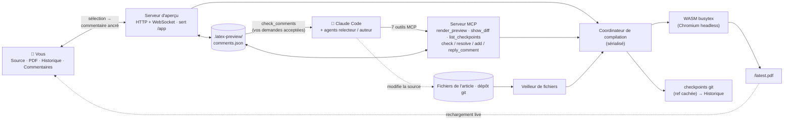

# MagicTeX — Éditeur LaTeX pour agents IA

<!-- badges -->
[](https://www.npmjs.com/package/magictex-mcp)
[](https://registry.modelcontextprotocol.io)
[](https://github.com/ZoeLinUTS/MagicTeX-mcp/actions/workflows/ci.yml)
[](https://github.com/ZoeLinUTS/MagicTeX-mcp/stargazers)
[](https://github.com/ZoeLinUTS/MagicTeX-mcp/commits/main)
[](../../LICENSE)
[](https://github.com/sponsors/ZoeLinUTS)

[English](../../README.md) · [简体中文](README.zh-CN.md) · [日本語](README.ja.md) · [한국어](README.ko.md) · [Español](README.es.md) · **Français** · [Deutsch](README.de.md) · [Português](README.pt.md)


**MagicTeX** est un **éditeur LaTeX conçu pour les agents IA** : un espace de travail à
**fenêtre unique** façon Overleaf pour Claude Code, fourni par un serveur MCP, **sans
installation locale de TeX ni compte Overleaf** : aperçu PDF en direct, un éditeur de code
avec **mode Visuel (WYSIWYG)**, historique des modifications, et **des commentaires que vous
ancrez sur le PDF rendu et qui deviennent des instructions d'édition pour l'agent**. (paquet
npm : `magictex-mcp`.)

Il compile avec un moteur WASM TeX Live 2026
([texlyre-busytex](https://github.com/TeXlyre/texlyre-busytex)) tournant dans un navigateur
headless : rien de plusieurs Go à installer — juste un téléchargement unique des ressources
WASM.

## À voir avant d'installer

Un parcours guidé de la boucle commentaire → agent se trouve sur
**[zoelin.dev/tools/magictex](https://zoelin.dev/tools/magictex)**, construit à partir de
sorties réelles de l'outil. C'est une rediffusion, pas une instance hébergée : le moteur TeX
est un téléchargement unique d'environ 650 Mo et la moitié « agent » est Claude lui-même —
MagicTeX tourne donc à côté de votre projet, pas dans une page web.

## L'espace de travail

Une seule fenêtre de navigateur (inspirée de l'édition à surface unique de Typst et des
annotations ancrées de LiquidText) :

```
┌──────────────────────────────────────────────────────────────┐
│  ✓ à jour · 13 pages           Exporter .zip · Télécharger   │
├────────────┬──────────────────────────────┬──────────────────┤
│ Source /   │        PDF (en direct)       │  Commentaires    │
│ Historique │  sélection → 💬 commentaire  │  acceptés → que  │
│  éditeur,  │  les surlignages ne bougent  │  Claude s'en     │
│  frise     │  recharge à chaque édition   │  occupe → ✓      │
│  + diffs   │                              │                  │
└────────────┴──────────────────────────────┴──────────────────┘
```

- **Boucle commentaire → agent (l'essentiel).** Relisez le document *rendu* comme on annote une
  épreuve papier : sélectionnez du texte, ajoutez un commentaire. Dites ensuite à Claude
  « address my comments » — il les récupère via `check_comments` sous forme de **tâches
  localisées** (page + citation + le `fichier:ligne` source + votre demande), modifie la source
  et résout chaque carte avec une note.
- **Panneau de code éditable + arborescence de fichiers.** Éditeur LaTeX CodeMirror,
  arborescence façon Overleaf (dossiers, nouveau/renommer/supprimer, changer de fichier). Ctrl+S
  recompile.
- **Mode Visuel (WYSIWYG).** Titres, gras, italique et formules `$…$` et `\begin{equation}` sont
  rendus sur place ; au survol, le LaTeX d'origine réapparaît pour l'édition.
- **Flux de revue (relecteur → validation humaine → auteur).** Un agent relecteur/défenseur
  publie des commentaires via `add_comment` ; vous **acceptez/refusez** (ou activez le mode
  copilote *auto-accepter*) ; une boucle auteur résout les acceptés.
- **Historique des modifications.** Chaque compilation réussie est capturée dans une **ref git
  cachée**, sans toucher à vos branches ni à votre `git log`.
- **Enregistrer et recompiler sont deux choses.** L'éditeur intégré enregistre seul toutes les
  30 s sans recompiler ; **Ctrl+S / Enregistrer / Recompiler** refont le PDF à la demande.
  (Activez **⚡ Live** pour recompiler au fil de la frappe.) Votre propre éditeur et les
  modifications de Claude continuent de recompiler automatiquement via le veilleur.
- **Rechargement en direct.** Un veilleur de fichiers recompile à chaque enregistrement — que
  la modification vienne de Claude, de l'éditeur intégré ou de votre éditeur externe.
- **Aller vers Overleaf.** **Télécharger le PDF**, **Exporter .zip** (uniquement les entrées de
  compilation) et un lien **Open in Overleaf** en un clic pour les dépôts GitHub publics ; la
  synchronisation via le pont Git Premium est un `git push` documenté. Voir
  [`USER-GUIDE.fr.md`](USER-GUIDE.fr.md).
- **Vrais projets.** Détecte le fichier principal, rassemble les `\input`/`\include`
  multi-fichiers, les `.bib`, les `.cls`/`.sty`/`.bst` du dépôt et les figures, lance BibTeX et
  le relance si nécessaire ; les paquets couramment manquants sont ajoutés automatiquement.
- **Backend de compilation.** Utilise votre **latexmk** local si vous en avez un — fidélité
  complète des paquets, sortie identique à Overleaf — sinon le **WASM** TeX Live embarqué, sans
  rien installer. Forcez avec `backend: "system"` / `"wasm"`. Chaque compilation indique lequel
  a servi.
- **Classes de document.** `IEEEtran` est embarquée, car aucune classe de conférence ne figure
  dans le WASM TeX Live et une classe manquante ne se contourne pas comme un paquet. Les modèles
  de conférence (NeurIPS, ICML, CVPR, ACL, AAAI …) n'ont pas de licence redistribuable : placez
  le `.cls` du kit auteur à côté de vos sources — il est repris automatiquement.
- **Outils MCP :** `render_preview` (compiler et ouvrir l'espace de travail),
  `check_comments` / `resolve_comment` / `add_comment` / `reply_to_comment` (la boucle de
  revue), `show_diff` (diff côte à côte en image — utile sur les clients qui gèrent l'image).
- **Erreurs exploitables.** Les compilations en échec renvoient des erreurs
  `{file, line, message}` déjà analysées, pour que Claude se corrige, et s'affichent dans
  l'espace de travail.

## Installation

MagicTeX est sur npm sous le nom [`magictex-mcp`](https://www.npmjs.com/package/magictex-mcp)
et référencé dans le [registre MCP officiel](https://registry.modelcontextprotocol.io) sous
**`io.github.ZoeLinUTS/magictex`** — n'importe quel client qui lit le registre peut donc le
trouver. Rien à cloner, pas de TeX à installer ; `npx` le récupère au premier usage.

1. Ajoutez-le au `.mcp.json` de votre projet (voir [`.mcp.json.example`](../../.mcp.json.example)) :

   ```json
   {
     "mcpServers": {
       "magictex": { "command": "npx", "args": ["-y", "magictex-mcp"] }
     }
   }
   ```

2. **Redémarrez Claude Code** (ou reconnectez avec `/mcp`) pour charger le serveur.
3. Demandez à Claude « render a preview of this paper » — la première fois télécharge les
   ressources WASM TeX Live (~650 Mo, une seule fois), compile et ouvre l'aperçu en direct.
   Les modifications suivantes le rechargent automatiquement.

   Pour du développement local depuis un clone, pointez plutôt vers les sources :
   `"command": "npx", "args": ["tsx", "/chemin/absolu/magictex-mcp/src/server.ts"]`

Les ressources WASM ne sont **pas** dans ce dépôt. Elles sont récupérées au premier lancement
dans un cache **par utilisateur** — `~/Library/Caches/magictex` sur macOS,
`$XDG_CACHE_HOME/magictex` sur Linux, `%LOCALAPPDATA%\magictex` sur Windows — de sorte que mettre
MagicTeX à jour ne les retélécharge pas, et qu'un clone, une installation globale et une
exécution `npx` partagent une seule copie. Utilisez `MAGICTEX_ASSETS_DIR` pour les placer
ailleurs. Pour les précharger : `npx texlyre-busytex download-assets <ce répertoire>`.

## Installer comme plugin Claude Code (commandes slash)

Pour taper moins, installez MagicTeX comme plugin — une seule installation vous donne le serveur
MCP **et** les commandes slash :

```
/plugin marketplace add ZoeLinUTS/MagicTeX-mcp
/plugin install magictex
```

- **`/magic-latex`** — compile et ouvre l'espace de travail.
- **`/ai-review [skill]`** — relit l'article avec une skill (par défaut
  `academic-paper-revision` ; n'importe quel nom fonctionne) et publie des commentaires à
  accepter/refuser.
- **`/address-comments`** — résout vos commentaires acceptés (`/loop 60s /address-comments`).
- ⚡ **`/ultra-agents [skill] [depth]`** — mode entièrement autonome : relit, accepte
  automatiquement, corrige, recommence, jusqu'à `depth` tours (2 par défaut), en
  s'arrêtant plus tôt si un tour ne trouve rien de nouveau. Aucune approbation entre
  les tours — c'est le principe, et le risque. Au-delà de `depth = 5`, une
  confirmation est demandée avant de démarrer. Se termine par un résumé (ce qui a
  été relevé, ce qui a changé, quels checkpoints regarder) — chaque tour reste un
  checkpoint normal et réversible.

### Une commande par outil

Chaque outil MCP a aussi une commande du **même nom**, vous pouvez donc exécuter n'importe quelle étape en tapant le nom de l'outil. La règle à enseigner : *l'outil est `X` → tapez `/X`*.

| Tapez ceci | Exécute l'outil | Ce que ça fait |
| --- | --- | --- |
| `/render_preview` | `render_preview` | Compile l'article et ouvre/rafraîchit l'aperçu en direct. |
| `/check_comments` | `check_comments` | Liste les commentaires acceptés comme instructions (sans encore éditer). |
| `/resolve_comment [id] [note]` | `resolve_comment` | Marque un commentaire comme fait après l'édition ; il passe au **vert** pour votre relecture. |
| `/add_comment ["citation"] [note]` | `add_comment` | Ancre un commentaire sur un passage à accepter/refuser. |
| `/reply_to_comment [id] [texte]` | `reply_to_comment` | Ajoute une réponse au fil d'un commentaire. |
| `/show_diff [checkpoint]` | `show_diff` | Diff visuel côte à côte en image (modifications actuelles ou un checkpoint). |
| `/list_checkpoints [limit]` | `list_checkpoints` | Checkpoints récents avec leur sha, du plus récent — pour en passer un à `/show_diff`. |

Rien ne vous oblige à les taper : le langage naturel marche aussi (*« affiche un aperçu »*, *« traite mes commentaires »*). Les commandes sont juste un raccourci rapide et facile à enseigner.

> Le plugin embarque le serveur MCP (`npx magictex-mcp`) : l'installer suffit — le `.mcp.json`
> ci-dessus est l'alternative si vous préférez ne pas installer de plugin. Les commandes slash
> fonctionnent dans les deux cas.

## Tools (outils)

La surface MCP, pour tout client qui parle MCP. (Dans Claude Code, le langage naturel ou les commandes ci-dessus suffisent — voici les outils sous-jacents.)

| Outil | Paramètres | Ce que ça fait |
| ---- | ---- | ---- |
| `render_preview` | `mainFile?` · `engine?` (`pdflatex` \| `xelatex` \| `lualatex`, par défaut `xelatex`) · `backend?` (`wasm` \| `system` \| `auto`, par défaut `auto` — latexmk local s'il est installé, sinon le moteur WASM fourni) | Compile le projet et ouvre/rafraîchit l'espace de travail en direct. Si omis, le fichier principal est détecté en cherchant `\documentclass`. |
| `check_comments` | `includeResolved?` (par défaut `false`) | Renvoie les commentaires acceptés sous forme de **tâches localisées** : page, citation, le `fichier:ligne` source et votre demande. Les suggestions d'un relecteur en attente de votre décision sont signalées mais pas renvoyées comme travail. |
| `add_comment` | `quote` · `comment` · `role?` (`reviewer` \| `defender`) · `page?` · `accepted?` | Ancre un commentaire sur un passage. Publié comme **suggestion** en attente de votre Accept/Refus, sauf si `accepted` est activé — c'est précisément ce drapeau qui rend le mode autonome autonome. |
| `resolve_comment` | `id` · `note` | Marque un commentaire comme traité après l'édition, avec une ligne sur ce qui a changé. Il passe au **vert** dans l'espace de travail, en attente de votre relecture. |
| `reply_to_comment` | `id` · `text` · `role?` (`author` \| `reviewer` \| `defender`) | Ajoute une réponse au fil, pour trancher un désaccord sur le commentaire plutôt que dans le chat. |
| `show_diff` | `checkpoint?` | Rend un diff côte à côte **sous forme d'image**, affichée dans la conversation. Par défaut les modifications non validées ; passez un sha de checkpoint pour une version enregistrée. |
| `list_checkpoints` | `limit?` (par défaut 10, max 50) | Checkpoints récents avec leur sha, du plus récent — pour trouver lequel passer à `show_diff`. |

**Les fonctionnalités phares sont bâties *sur* ces outils, elles n'en font pas partie.** `/magic-latex`, `/ai-review`, `/address-comments` et ⚡ `/ultra-agents` sont des **commandes du plugin** Claude Code qui orchestrent les outils ci-dessus — `/ultra-agents` enchaîne relire → accepter automatiquement → corriger sur autant de tours que vous l'autorisez, et c'est la raison d'être du paramètre `accepted` d'`add_comment`. Elles ne font pas partie de la surface MCP : un autre client MCP ne voit que ces sept outils. Voir la section plugin plus haut et [docs/AGENT-LOOP.fr.md](AGENT-LOOP.fr.md).

## À quoi ça ressemble dans le terminal

Voici de vraies sorties d'outils, reprises mot pour mot d'une exécution réelle sur l'article
d'exemple — rien n'est mis en scène. C'est ce que vous voyez dans Claude Code pendant que
l'espace de travail du navigateur (la capture ci-dessus) reflète le même état en direct.

Vous tapez :
```
/magic-latex
```
Claude appelle `render_preview` et répond :
```
✓ Compiled main.tex with xelatex in 1900ms — 2 files. Workspace (live preview,
source editor, history, PDF comments — auto-reloads on edits):
http://127.0.0.1:52042/app
```

Vous (ou une skill relectrice) laissez un commentaire, puis demandez ce qui est prêt à traiter.
Claude appelle `check_comments` :
```
1 accepted comment — edit each at its source location per the instruction, then
call resolve_comment with its id and a one-line note:

[id: 2fce9e3c8b5f] p.1 — "Sorting widgets efficiently is a long-standing problem"
  ↳ source: main.tex:15
  → Tighten this opening sentence.

(1 reviewer suggestion still awaits the human's accept in the workspace — not
actionable yet.)
```
Claude fait la modification et appelle `resolve_comment` :
```
✓ Resolved comment 2fce9e3c8b5f ("Sorting widgets efficiently is a long-standing
problem…") — the card now shows: Rewrote the opening sentence.
```
Redemandez, et la file des acceptés est vide — il ne reste que la suggestion non acceptée, qui
vous attend :
```
No accepted comments. (2 already resolved.)

(1 reviewer suggestion still awaits the human's accept in the workspace — not
actionable yet.)
```

## Comment ça marche

```
Claude modifie .tex ─┐
 veilleur ───────────┼─▶ coordinateur ─▶ Chromium headless ─▶ WASM TeX ─▶ PDF
 render_preview ─────┘   (sérialisé)     (hôte du moteur)                │
                                                                         ▼
       votre espace de travail (/app)  ◀── WebSocket "reload" ◀── serveur HTTP local
       Source · PDF · Historique · Commentaires    (sert /app et /latest.pdf)
```

Les moteurs WASM ont besoin des globales DOM/Worker : le serveur héberge donc un Chromium
headless caché comme ouvrier de compilation ; l'espace de travail que *vous* ouvrez est une
petite application React + pdf.js, sans aucun WASM dedans. Voir
[`ARCHITECTURE.fr.md`](ARCHITECTURE.fr.md).



Les deux portes d'entrée — vous dans l'espace de travail, les agents par les 7 outils MCP — se
rejoignent sur le même coordinateur, le même magasin de commentaires et le même historique git.
Vous agissez sur le *document rendu* (ancrer un commentaire) ; Claude agit sur la *source* (lit
vos commentaires via `check_comments`, modifie, `resolve_comment`). C'est ce socle partagé qui
rend possibles la boucle de commentaires, le flux de revue et un historique traçable.

## Prérequis

- Node 20.19+ (le plancher dont `chokidar` et `playwright` ont réellement besoin ; le serveur
  le vérifie au démarrage et, si ce n'est pas le cas, le dit clairement et refuse de démarrer au
  lieu de lever une erreur qui ne parle pas de Node)
- Le Chromium de Playwright (installé automatiquement ; ~150–300 Mo) — ou configurez-le pour
  réutiliser votre Chrome déjà installé.
- ~650 Mo de disque pour les ressources WASM TeX Live, une seule fois — tout est téléchargé au
  premier lancement, en trois jeux de paquets (basic 87 Mo, recommended 190 Mo, extra 324 Mo,
  plus 31 Mo de moteur). Un article normal ne *charge* que le jeu basic ; les deux autres
  restent sur le disque jusqu'à ce que quelque chose en ait besoin. Le cache est par
  utilisateur, pas par installation : mettre MagicTeX à jour ne les retélécharge pas. Changez
  l'emplacement avec `MAGICTEX_ASSETS_DIR`.
- **Une distribution TeX locale est facultative.** Voir ci-dessous quand elle compte.

### Ai-je besoin d'une distribution TeX locale ?

Non — le moteur WASM fourni compile sans rien installer, c'est tout l'intérêt.
Mais il embarque un *sous-ensemble* de TeX Live : `svg`, la plupart des classes
de conférence et divers paquets moins courants n'y sont pas. Quand il en manque
un, on vous le dit, plutôt que de vous rendre un PDF silencieusement faux.

Installez une distribution lorsque vous voulez une sortie identique à celle
d'Overleaf. MagicTeX la détecte seul, sans configuration :

| | |
|---|---|
| macOS | [MacTeX](https://tug.org/mactex/) |
| Linux | `texlive-full` |
| Windows | [TeX Live](https://tug.org/texlive/) |

> `latexmk` est ce que MagicTeX cherche dans le `PATH`, mais il ne s'installe
> pas séparément : c'est un script fourni par les distributions ci-dessus.
> Vérifiez avec `which latexmk` ; sur macOS, il faut parfois d'abord
> `eval "$(/usr/libexec/path_helper)"` ou un nouveau terminal.

Chaque compilation indique laquelle a servi — `xelatex · system` ou `xelatex · wasm`.

## Développement

```bash
npm install
npm run typecheck    # tsc pour le serveur et pour l'UI
npm run build:ui     # construit l'espace de travail React dans ui/dist
npm test             # la suite unitaire — sans moteur, sans navigateur, quelques secondes
npm start            # lance le serveur sur stdio (pour un client MCP manuel)
```

Deux niveaux, délibérément. `npm test` couvre le magasin de commentaires, l'ancrage par texte,
la géométrie des lignes et des colonnes, le dépôt d'historique, les chemins de ressources, la
classification du log de compilation, l'arrêt du serveur d'aperçu, et un E2E du flux MCP — le
tout sans navigateur ni moteur TeX, donc rapide et déterministe. La CI
(`.github/workflows/ci.yml`) exécute typecheck + build de l'UI + cette suite sur Node 20 et 22 à
chaque push et chaque pull request.

Ce qu'un test unitaire **ne peut structurellement pas voir** — la géométrie des surlignages à
plusieurs niveaux de zoom, ce qu'un rendu en échec dit réellement au lecteur, si l'arrêt ferme
bien le serveur et prévient les fenêtres restées ouvertes — vit dans `scripts/smoke-*.mjs` et
tourne contre un vrai navigateur et une vraie compilation dans
`.github/workflows/smoke-macos.yml`. Chacun existe parce que **quelque chose est parti en
production cassé avec la suite unitaire au vert**. Gardez les deux au vert et ajoutez de la
couverture avec vos changements.

## Documentation

- [**Guide utilisateur**](USER-GUIDE.fr.md) — usage quotidien, la boucle de commentaires, le mode
  Visual, l'arborescence de fichiers, amener votre article dans Overleaf, couverture des paquets.
- [**La boucle d'agent**](AGENT-LOOP.fr.md) — les commentaires comme déclencheurs, l'exécuter sans
  intervention avec `/loop`, le flux relecteur → validation → résolveur, et ⚡ `/ultra-agents`.
- [**Feuille de route**](ROADMAP.fr.md) — ce qui est livré pour les agents concurrents, et ce qu'il
  manque encore pour une édition multi-agent vraiment parallèle.
- [**Architecture**](ARCHITECTURE.fr.md) — pourquoi un navigateur headless, ce que fait chaque
  module, le flux de compilation.

Les quatre sont traduites dans les mêmes 8 langues que ce README — chaque page a son propre
sélecteur de langue en haut.

## Feuille de route

Plusieurs sessions Claude Code peuvent déjà travailler sur le même projet en parallèle sans
corrompre les commentaires ni l'historique des checkpoints (voir
[`ROADMAP.fr.md`](ROADMAP.fr.md)) — la vraie édition multi-agents parallèle (relecteur / auteur /
défenseur sur leurs propres branches git, fusionnées ensuite) est le prochain jalon.

## Soutenir ce projet

MagicTeX est libre et open source (AGPL-3.0). S'il vous fait gagner du temps sur vos articles,
pensez à **[soutenir le projet](https://github.com/sponsors/ZoeLinUTS)**. Une ⭐ sur le dépôt
aide aussi.

## Remerciements

MagicTeX est écrit et maintenu par [Zoe Lin](https://zoelin.dev), construit avec **[Claude Code](https://claude.com/claude-code)**.

Merci à **David Turnbull**, qui m'a raconté comment Knuth a passé dix ans à bâtir son
propre logiciel de composition plutôt que d'accepter l'allure de son livre — l'histoire
avec laquelle ce projet continue de débattre. Et aux mainteneurs de [`texlyre-busytex`](https://github.com/TeXlyre/texlyre-busytex), sans le
TeX Live WASM desquels rien de tout cela ne tournerait en local.

## Licence

[AGPL-3.0-or-later](../../LICENSE) — comme le moteur `texlyre-busytex` sur lequel il repose.
Voir [`THIRD_PARTY_NOTICES.md`](../../THIRD_PARTY_NOTICES.md).
