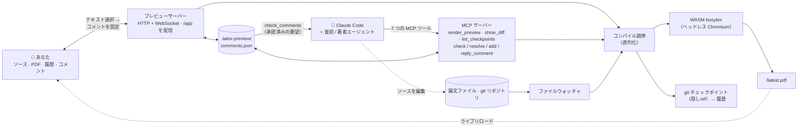

# MagicTeX — AI エージェントのための LaTeX エディタ

<!-- badges -->
[](https://www.npmjs.com/package/magictex-mcp)
[](https://registry.modelcontextprotocol.io)
[](https://github.com/ZoeLinUTS/MagicTeX-mcp/actions/workflows/ci.yml)
[](https://github.com/ZoeLinUTS/MagicTeX-mcp/stargazers)
[](https://github.com/ZoeLinUTS/MagicTeX-mcp/commits/main)
[](../../LICENSE)
[](https://github.com/sponsors/ZoeLinUTS)

[English](../../README.md) · [简体中文](README.zh-CN.md) · **日本語** · [한국어](README.ko.md) · [Español](README.es.md) · [Français](README.fr.md) · [Deutsch](README.de.md) · [Português](README.pt.md)


**MagicTeX** は **AI エージェントのために作られた LaTeX エディタ**です。MCP サーバー経由で
Claude Code に接続する、Overleaf ライクな**ワンウィンドウ・ワークスペース**で、
**ローカルの TeX インストールも Overleaf アカウントも不要**：ライブ PDF プレビュー、
**ビジュアル（WYSIWYG）モード**付きのソースエディタ、変更履歴、そして
**レンダリング後の PDF 上にアンカーしたコメントが、そのままエージェントへの編集指示になります**。
（npm パッケージ名：`magictex-mcp`）

ヘッドレスブラウザ内で動く WASM TeX Live 2026 エンジン
（[texlyre-busytex](https://github.com/TeXlyre/texlyre-busytex)）でコンパイルするため、
数 GB のインストールは不要——一度きりの WASM アセットのダウンロードだけです。

## インストール前に見てみる

**[zoelin.dev/tools/magictex](https://zoelin.dev/tools/magictex)** に、コメント → エージェントの
ループを段階的にたどるウォークスルーがあります。内容はすべて実際のツール出力から作られています。
これはリプレイであり、ホストされたインスタンスではありません——TeX エンジンは約 650 MB の
一回きりのダウンロードで、エージェントの半分は Claude そのものなので、MagicTeX はウェブページの
中ではなく、あなたのプロジェクトの隣で動きます。

## ワークスペース

1 つのブラウザウィンドウ（Typst の単一画面編集と LiquidText のアンカー注釈にヒント）：

```
┌──────────────────────────────────────────────────────────────┐
│  ✓ 最新の状態 · 13 ページ       .zip エクスポート · PDF 保存 │
├────────────┬──────────────────────────────┬──────────────────┤
│ ソース /   │        PDF（ライブ）         │    コメント      │
│ 履歴       │  テキスト選択 → 💬 コメント  │  承認したものを  │
│  エディタ、│  ハイライトは位置を保つ      │  Claude に処理   │
│  タイムライン  編集のたびに自動リロード   │  させる → 解決 ✓ │
│  ＋差分    │                              │                  │
└────────────┴──────────────────────────────┴──────────────────┘
```

- **コメント → エージェントのループ（核心）。** レンダリング後の文書を、印刷原稿に赤入れ
  するように査読：テキストを選択してコメントを付ける。あとは Claude に「address my comments」と
  伝えるだけ——`check_comments` で**位置情報付きの作業項目**（ページ＋引用＋対応ソースの
  `ファイル:行`＋要望）として取得し、ソースを編集し、各カードにメモを付けて解決します。
- **編集可能なソースパネル＋ファイルツリー。** CodeMirror LaTeX エディタ、Overleaf 風の
  ファイルツリー（フォルダ、新規/リネーム/削除、ファイル切替）。Ctrl+S で再コンパイル。
- **ビジュアル（WYSIWYG）モード。** 見出し・太字・斜体・`$…$` や `\begin{equation}` の数式を
  その場で描画。カーソルを合わせると元の LaTeX が表示され編集できます。
- **査読ワークフロー（reviewer → 人間の承認 → 修正）。** reviewer/defender エージェントが
  `add_comment` でコメントを投稿。あなたが **Accept/Reject**（または *自動承認* の
  コパイロットモード）。author ループが承認済みを解決します。
- **変更履歴。** 成功したコンパイルごとに**隠し git ref** へ自動スナップショット。
  あなたのブランチや `git log` を汚しません。
- **保存と再コンパイルは別。** 内蔵エディタは 30 秒ごとに自動保存しますが再コンパイルは
  しません。**Ctrl+S / 保存 / Recompile** で必要なときに PDF を作り直します。（**⚡ Live**
  を入れると打鍵ごとに再コンパイル。）外部エディタと Claude の編集はウォッチャ経由で
  引き続き自動再コンパイルされます。
- **ライブリロード。** ファイルウォッチャが保存のたびに再コンパイルします——Claude の編集、
  内蔵エディタ、あなたの外部エディタ、どれでも同じです。
- **Overleaf へ持っていく。** **PDF ダウンロード**、**.zip エクスポート**（ビルド入力だけの
  きれいな一式）、公開 GitHub リポジトリ向けのワンクリック **Open in Overleaf** リンク。
  Premium の Git ブリッジ同期はドキュメント化された `git push` です。
  [`USER-GUIDE.ja.md`](USER-GUIDE.ja.md) を参照。
- **実際のプロジェクト。** メインファイルを自動判別し、複数ファイルの `\input`/`\include`、
  `.bib`、リポジトリ内の `.cls`/`.sty`/`.bst`、図版を収集し、BibTeX を実行して必要なら
  再実行します。よくある不足パッケージは自動で補われます。
- **コンパイルバックエンド。** ローカルに **latexmk** があればそれを使い（パッケージ完全、
  Overleaf と一致する出力）、なければ同梱のインストール不要な **WASM** TeX Live を使います。
  `backend: "system"` / `"wasm"` で強制指定可能。どちらが走ったかは毎回報告されます。
- **ドキュメントクラス。** `IEEEtran` は同梱です——WASM TeX Live にはどの学会クラスも
  入っておらず、クラスの不足はパッケージのように回避できないからです。学会テンプレート
  （NeurIPS、ICML、CVPR、ACL、AAAI …）は再配布可能なライセンスを持たないため、著者キットの
  `.cls` をソースの隣に置いてください——自動的に拾われます。
- **MCP ツール：** `render_preview`（コンパイル＋ワークスペースを開く）、`check_comments` /
  `resolve_comment` / `add_comment` / `reply_to_comment`（査読ループ）、`show_diff`
  （並列差分を画像で——画像対応クライアントで有用）。
- **実行可能なエラー。** コンパイル失敗時は解析済みの `{file, line, message}` を返すので
  Claude が自己修正でき、ワークスペースにも表示されます。

## セットアップ

MagicTeX は npm では [`magictex-mcp`](https://www.npmjs.com/package/magictex-mcp)、
[公式 MCP レジストリ](https://registry.modelcontextprotocol.io) には
**`io.github.ZoeLinUTS/magictex`** として登録されています——レジストリを読むクライアントなら
どれでも見つけられます。クローンするものはなく、TeX のインストールも不要。`npx` が初回に
取得します。

1. 論文プロジェクトの `.mcp.json` に追加（[`.mcp.json.example`](../../.mcp.json.example) 参照）：

   ```json
   {
     "mcpServers": {
       "magictex": { "command": "npx", "args": ["-y", "magictex-mcp"] }
     }
   }
   ```

2. **Claude Code を再起動**（または `/mcp` で再接続）してサーバーを読み込みます。
3. Claude に「render a preview of this paper」と依頼——初回は WASM TeX Live アセット
   （約 650 MB、一度きり）をダウンロードし、コンパイルしてライブプレビューを開きます。
   以降の編集は自動でリロードされます。

   クローンからローカル開発する場合は、代わりにソースを指してください：
   `"command": "npx", "args": ["tsx", "/絶対パス/magictex-mcp/src/server.ts"]`

WASM アセットはこのリポジトリには**含まれていません**。初回実行時に**ユーザーごとの**
キャッシュへ取得されます——macOS は `~/Library/Caches/magictex`、Linux は
`$XDG_CACHE_HOME/magictex`、Windows は `%LOCALAPPDATA%\magictex`。そのため MagicTeX を
更新しても再ダウンロードは起きず、チェックアウト・グローバルインストール・`npx` 実行が
1 つのコピーを共有します。`MAGICTEX_ASSETS_DIR` で場所を変更できます。事前取得は
`npx texlyre-busytex download-assets <そのディレクトリ>`。

## Claude Code プラグインとして導入（スラッシュコマンド）

タイピングを減らすには、MagicTeX をプラグインとして導入——1 回のインストールで MCP サーバーと
スラッシュコマンドの両方が手に入ります：

```
/plugin marketplace add ZoeLinUTS/MagicTeX-mcp
/plugin install magictex
```

- **`/magic-latex`** — コンパイルしてワークスペースを開く。
- **`/ai-review [skill]`** — スキルで論文を査読（既定は `academic-paper-revision`、
  任意のスキル名も可）し、承認用のコメントを投稿。未導入のスキルは案内を表示。
- **`/address-comments`** — 承認済みコメントを解決（`/loop 60s /address-comments` も可）。
- ⚡ **`/ultra-agents [skill] [depth]`** — 完全自動モード：査読・自動承認・修正を繰り返す。
  最大 `depth` ラウンド（既定 2）、あるラウンドで新規指摘がゼロなら早期停止。ラウンド間
  で承認確認は挟まない——それがこのモードの目的でありリスクでもある。`depth` が 5 を
  超えると開始前に確認を求める。終了後は要約（何を指摘し何を変更したか、対応する
  checkpoint）を提示。各ラウンドも通常どおり取り消し可能な checkpoint のまま。

### ツールごとに 1 コマンド

各 MCP ツールには**同名**のスラッシュコマンドがあり、ツール名を打つだけで各ステップを実行できます。教えるルールは一言：**ツールが `X` なら `/X` と打つ**。

| これを打つ | 実行ツール | 内容 |
| --- | --- | --- |
| `/render_preview` | `render_preview` | 論文をコンパイルしてライブプレビューを開く/更新。 |
| `/check_comments` | `check_comments` | 承認済みコメントを編集指示として一覧表示（まだ編集しない）。 |
| `/resolve_comment [id] [メモ]` | `resolve_comment` | 編集後に解決としてマーク；コメントが**緑**になり確認待ち。 |
| `/add_comment ["引用"] [メモ]` | `add_comment` | 該当箇所にコメントをアンカーし、承認/却下できるように。 |
| `/reply_to_comment [id] [本文]` | `reply_to_comment` | コメントにスレッド返信を追加。 |
| `/show_diff [checkpoint]` | `show_diff` | 並列ビジュアル差分を画像で表示（現在の変更か checkpoint）。 |
| `/list_checkpoints [limit]` | `list_checkpoints` | 直近のチェックポイントを sha 付きで新しい順に表示——`/show_diff` に渡す sha を探すのに。 |

必ずしも打つ必要はありません——普通の日本語でも動きます（「プレビューを表示」「コメントに対応して」）。コマンドは速くて教えやすい省略形です。

> プラグインには MCP サーバー（`npx magictex-mcp`）が同梱されているので、プラグインを
> 入れればそれだけで足ります——上の `.mcp.json` は「プラグインを入れたくない」場合の
> 代替手段です。スラッシュコマンドはどちらでも動きます。

## Tools（ツール）

MCP を話すあらゆるクライアント向けのインターフェース層です。（Claude Code では普通の日本語か上のスラッシュコマンドで十分——これはその下にある実体です。）

| ツール | 引数 | 何をするか |
| ---- | ---- | ---- |
| `render_preview` | `mainFile?` · `engine?`（`pdflatex` \| `xelatex` \| `lualatex`、既定 `xelatex`）· `backend?`（`wasm` \| `system` \| `auto`、既定 `auto` — ローカルに latexmk があればそれを、なければ同梱の WASM エンジンを使用） | プロジェクトをコンパイルしてライブワークスペースを開く／更新。省略時は `\documentclass` を走査して主ファイルを自動判定。 |
| `check_comments` | `includeResolved?`（既定 `false`） | 受理済みコメントを**位置情報付きの作業項目**として返す——ページ、引用箇所、対応するソースの `ファイル:行`、依頼内容。判断待ちの reviewer 提案は通知されるだけで作業としては返らない。 |
| `add_comment` | `quote` · `comment` · `role?`（`reviewer` \| `defender`）· `page?` · `accepted?` | コメントを本文に固定する。既定では Accept/Reject 待ちの**提案**として投稿され、`accepted` を立てたときだけ即有効——このフラグこそが自律モードを自律たらしめている。 |
| `resolve_comment` | `id` · `note` | 編集後にコメントを完了扱いにし、変更内容を一行で記す。ワークスペースで**緑**になり、確認待ちになる。 |
| `reply_to_comment` | `id` · `text` · `role?`（`author` \| `reviewer` \| `defender`） | コメントにスレッド返信を追加。意見の相違をチャットではなくコメント上で解消できる。 |
| `show_diff` | `checkpoint?` | 並列 diff を**画像**として描画し、会話内にインライン表示。既定は未コミットの変更、checkpoint の sha を渡せばその保存版。 |
| `list_checkpoints` | `limit?`（既定 10、最大 50） | 最近の checkpoint と sha を新しい順に一覧——`show_diff` に渡すものを探すために使う。 |

**看板機能はこれらの上に構築されており、この表の中にはありません。** `/magic-latex`・`/ai-review`・`/address-comments`・⚡ `/ultra-agents` は Claude Code の**プラグインコマンド**で、上の各ツールを組み立てて動かします——`/ultra-agents` は「レビュー → 自動承認 → 修正」を許可したラウンド数だけ連鎖させるもので、`add_comment` の `accepted` はそのために存在します。MCP のインターフェース層には含まれないため、他の MCP クライアントからはこの 7 つだけが見えます。上のプラグイン節と [docs/AGENT-LOOP.ja.md](AGENT-LOOP.ja.md) を参照。

## ターミナルでの見え方

以下はサンプル論文に対する実際の実行から一字一句そのまま取った本物のツール出力で、
作り物ではありません。Claude Code で見えるのはこれで、ブラウザのワークスペース（上の
スクリーンショット）は同じ状態をライブに映します。

あなたが入力：
```
/magic-latex
```
Claude が `render_preview` を呼び、こう返します：
```
✓ Compiled main.tex with xelatex in 1900ms — 2 files. Workspace (live preview,
source editor, history, PDF comments — auto-reloads on edits):
http://127.0.0.1:52042/app
```

あなた（または reviewer スキル）がコメントを残し、「いま何に着手できるか」を尋ねます。
Claude が `check_comments` を呼びます：
```
1 accepted comment — edit each at its source location per the instruction, then
call resolve_comment with its id and a one-line note:

[id: 2fce9e3c8b5f] p.1 — "Sorting widgets efficiently is a long-standing problem"
  ↳ source: main.tex:15
  → Tighten this opening sentence.

(1 reviewer suggestion still awaits the human's accept in the workspace — not
actionable yet.)
```
Claude が編集し、`resolve_comment` を呼びます：
```
✓ Resolved comment 2fce9e3c8b5f ("Sorting widgets efficiently is a long-standing
problem…") — the card now shows: Rewrote the opening sentence.
```
もう一度尋ねると承認済みキューは空です——残るのはまだ承認していない提案だけで、
あなたを待っています：
```
No accepted comments. (2 already resolved.)

(1 reviewer suggestion still awaits the human's accept in the workspace — not
actionable yet.)
```

## 仕組み

```
Claude が .tex を編集 ─┐
 ファイルウォッチャ ───┼─▶ コンパイル調停 ─▶ ヘッドレス Chromium ─▶ WASM TeX ─▶ PDF
 render_preview ───────┘   （直列化）        （エンジンホスト）             │
                                                                            ▼
        あなたのワークスペース (/app)  ◀── WebSocket "reload" ◀── ローカル HTTP サーバー
        ソース · PDF · 履歴 · コメント         （/app と /latest.pdf を配信）
```

WASM エンジンは DOM/Worker のグローバルを必要とするため、サーバーは隠しヘッドレス
Chromium をコンパイルワーカーとして抱えます。*あなたが*開くワークスペースは軽量な
React + pdf.js アプリで、WASM は入っていません。
[`ARCHITECTURE.ja.md`](ARCHITECTURE.ja.md) を参照。



2 つの入口——ワークスペースにいるあなたと、7 つの MCP ツールを通るエージェント——は、
同じ調停役・同じコメントストア・同じ git 履歴で出会います。あなたは*描画された文書*を
操作し（コメントを固定する）、Claude は*ソース*を操作します（`check_comments` で読み、
編集し、`resolve_comment`）。この共有の土台こそが、コメントループ・査読ワークフロー・
追跡可能な履歴を成り立たせています。

## 動作要件

- Node 20.19+（`chokidar` と `playwright` が実際に必要とする下限。サーバーは起動時に確認し、
  満たない場合は Node とは無関係なエラーを投げる代わりに、はっきりそう伝えて起動を拒否します）
- Playwright の Chromium（自動インストール、約 150–300 MB）——既存の Chrome を再利用する
  設定も可能です。
- 一回きりの WASM TeX Live アセットに約 650 MB のディスク——初回実行で全部取得され、
  3 つのパッケージセットに分かれています（basic 87 MB、recommended 190 MB、extra 324 MB、
  加えてエンジン 31 MB）。通常の論文が*読み込む*のは basic だけで、残り 2 つは必要になるまで
  ディスクに置かれたままです。インストールごとではなくユーザーごとのキャッシュなので、
  MagicTeX を更新しても再ダウンロードは起きません。場所は `MAGICTEX_ASSETS_DIR` で変更できます。
- **ローカルの TeX ディストリビューションは任意です。** 必要になる場面は次の通り。

### ローカルの TeX ディストリビューションは必要？

不要です — 同梱の WASM エンジンは何もインストールせずにコンパイルできます。それ
こそが狙いです。ただしこれは TeX Live の*サブセット*で、`svg`、ほとんどの会議用
ドキュメントクラス、その他あまり一般的でないパッケージは含まれません。足りない
ときは黙って誤った PDF を返すのではなく、その旨を通知します。

Overleaf と完全に一致する出力が必要になったらインストールしてください。
MagicTeX が自動的に検出します。設定は不要です：

| | |
|---|---|
| macOS | [MacTeX](https://tug.org/mactex/) |
| Linux | `texlive-full` |
| Windows | [TeX Live](https://tug.org/texlive/), or [MiKTeX](https://miktex.org/) **plus** [Strawberry Perl](https://strawberryperl.com/) |

> MagicTeX が `PATH` 上で探すのは `latexmk` ですが、これは単体でインストール
> するものではなく、上記ディストリビューションに含まれるドライバスクリプトです。
> 確認は `which latexmk` ではなく **`latexmk -version`** で行ってください。
> `latexmk` は Perl スクリプトで、MiKTeX は `latexmk.exe` を `PATH` に置く一方で
> それを動かす Perl を同梱しません——ファイルは見つかるのに実行できません。
> macOS では先に `eval "$(/usr/libexec/path_helper)"` を実行するか、端末を開き
> 直す必要があることがあります。

各コンパイルはどちらで実行したかを表示します — `xelatex · system` か `xelatex · wasm`。

## 開発

```bash
npm install
npm run typecheck    # サーバーと UI それぞれに tsc
npm run build:ui     # React ワークスペースを ui/dist へビルド
npm test             # ユニットスイート——エンジンなし、ブラウザなし、数秒
npm start            # stdio でサーバーを起動（手動の MCP クライアント用）
```

意図して 2 層になっています。`npm test` はコメントストア、アンカー照合、行と列の幾何、
履歴リポジトリ、アセットのパス、コンパイルログの分類、プレビューサーバーの終了処理、
そして MCP ワークフローの E2E をカバーします——どれもブラウザや TeX エンジンに触れないので、
速くて決定的です。CI（`.github/workflows/ci.yml`）は push と PR のたびに Node 20 と 22 で
typecheck ＋ UI ビルド ＋ このスイートを実行します。

ユニットテストが**構造上どうしても見られない**もの——複数のズーム倍率でのハイライトの位置、
レンダリング失敗が読み手に実際に何を伝えるか、終了時に本当にサーバーを閉じて開いたままの
ウィンドウに知らせるか——は `scripts/smoke-*.mjs` にあり、`.github/workflows/smoke-macos.yml`
で実物のブラウザと実物のコンパイルに対して走ります。そのひとつひとつが、**ユニットスイートが
緑のまま壊れて出荷されたことがある**から存在しています。両方を緑に保ち、変更にはカバレッジを
添えてください。

## ドキュメント

- [**ユーザーガイド**](USER-GUIDE.ja.md) —— 日常的な使い方、コメントループ、ビジュアルモード、
  ファイルツリー、論文を Overleaf へ持っていく方法、パッケージの対応状況。
- [**エージェントループ**](AGENT-LOOP.ja.md) —— トリガーとしてのコメント、`/loop` での放置運用、
  reviewer → 人間の承認 → resolver のワークフロー、そして ⚡ `/ultra-agents`。
- [**ロードマップ**](ROADMAP.ja.md) —— 並行 agent について何が実装済みで、本当の並列 multi-agent
  編集に何が足りないか。
- [**アーキテクチャ**](ARCHITECTURE.ja.md) —— なぜヘッドレスブラウザなのか、各モジュールの役割、
  コンパイルの流れ。

4 つとも本 README と同じ 8 言語に翻訳されています——各ページの上部に言語切替があります。

## ロードマップ

複数の Claude Code セッションが、コメントやチェックポイント履歴を壊すことなく同じ
プロジェクトを同時に扱えるところまでは既に来ています（[`ROADMAP.ja.md`](ROADMAP.ja.md)
参照）——本当の意味での並列 multi-agent 編集（reviewer / author / defender がそれぞれの
git ブランチで作業し、最後にマージして戻す）が次のマイルストーンです。

## このプロジェクトを支援

MagicTeX は無料のオープンソース（AGPL-3.0）です。論文作業の時間を節約できたなら、ぜひ
**[このプロジェクトを支援](https://github.com/sponsors/ZoeLinUTS)**してください。リポジトリへの
⭐ も励みになります。

## 謝辞

MagicTeX は [Zoe Lin](https://zoelin.dev) が開発・保守しています。**[Claude Code](https://claude.com/claude-code)** を使って作られました。

Knuth が自分の本の見栄えを受け入れる代わりに 10 年かけて自ら組版システムを作った
——このプロジェクトが今も向き合い続けている物語——を教えてくれた **David Turnbull**
に感謝します。そして [`texlyre-busytex`](https://github.com/TeXlyre/texlyre-busytex) のメンテナの皆さんへ。あの WASM 版 TeX Live なしには、
そもそもローカルで何ひとつ動きませんでした。

## ライセンス

[AGPL-3.0-or-later](../../LICENSE)——依存する `texlyre-busytex` エンジンに合わせています。
詳細は [`THIRD_PARTY_NOTICES.md`](../../THIRD_PARTY_NOTICES.md) を参照。
