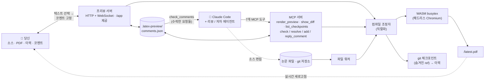

# MagicTeX — AI 에이전트를 위한 LaTeX 편집기

<!-- badges -->
[](https://www.npmjs.com/package/magictex-mcp)
[](https://registry.modelcontextprotocol.io)
[](https://github.com/ZoeLinUTS/MagicTeX-mcp/actions/workflows/ci.yml)
[](https://github.com/ZoeLinUTS/MagicTeX-mcp/stargazers)
[](https://github.com/ZoeLinUTS/MagicTeX-mcp/commits/main)
[](../../LICENSE)
[](https://github.com/sponsors/ZoeLinUTS)

[English](../../README.md) · [简体中文](README.zh-CN.md) · [日本語](README.ja.md) · **한국어** · [Español](README.es.md) · [Français](README.fr.md) · [Deutsch](README.de.md) · [Português](README.pt.md)


**MagicTeX** 는 **AI 에이전트를 위해 만들어진 LaTeX 편집기**입니다. MCP 서버를 통해 Claude
Code 에 연결되는 Overleaf 스타일의 **단일 창 작업 공간**으로, **로컬 TeX 설치도 Overleaf
계정도 필요 없습니다**: 실시간 PDF 미리보기, **비주얼(WYSIWYG) 모드**가 있는 소스 편집기,
변경 이력, 그리고 **렌더링된 PDF 위에 고정한 코멘트가 그대로 에이전트의 편집 지시가 됩니다**.
(npm 패키지: `magictex-mcp`)

헤드리스 브라우저에서 실행되는 WASM TeX Live 2026 엔진
([texlyre-busytex](https://github.com/TeXlyre/texlyre-busytex))으로 컴파일하므로, 수 GB를
설치할 필요가 없습니다 — 한 번만 WASM 자산을 내려받으면 됩니다.

## 설치 전에 먼저 보기

**[zoelin.dev/tools/magictex](https://zoelin.dev/tools/magictex)** 에 코멘트 → 에이전트 루프를
단계별로 따라가는 워크스루가 있습니다. 모든 내용은 실제 도구 출력에서 가져왔습니다. 호스팅된
인스턴스가 아니라 리플레이입니다——TeX 엔진은 약 650 MB를 한 번 내려받아야 하고, 에이전트 쪽
절반은 Claude 그 자체이므로, MagicTeX는 웹페이지 안이 아니라 당신의 프로젝트 옆에서 실행됩니다.

## 작업 공간

하나의 브라우저 창(Typst의 단일 화면 편집과 LiquidText의 고정 주석에서 영감):

```
┌──────────────────────────────────────────────────────────────┐
│  ✓ 최신 상태 · 13 페이지         .zip 내보내기 · PDF 받기    │
├────────────┬──────────────────────────────┬──────────────────┤
│ 소스 /     │        PDF(실시간)           │     코멘트       │
│ 이력       │  텍스트 선택 → 💬 코멘트     │  수락한 것을     │
│  편집기,   │  하이라이트는 제자리 유지    │  Claude에게      │
│  타임라인  │  편집할 때마다 자동 새로고침 │  맡김 → 해결 ✓   │
│  + diff    │                              │                  │
└────────────┴──────────────────────────────┴──────────────────┘
```

- **코멘트 → 에이전트 루프(핵심).** 렌더링된 문서를 인쇄물 첨삭하듯 검토: 텍스트를 선택해
  코멘트를 답니다. 그런 다음 Claude 에게 “address my comments”라고 말하면 — `check_comments`
  로 **위치 정보가 포함된 작업 항목**(페이지 + 인용 + 대응 소스의 `파일:줄` + 요청)을 가져와
  소스를 수정하고 각 카드에 메모와 함께 해결합니다.
- **편집 가능한 소스 패널 + 파일 트리.** CodeMirror LaTeX 편집기, Overleaf 식 파일 트리
  (폴더, 새로 만들기/이름 변경/삭제, 파일 전환). Ctrl+S 로 재컴파일.
- **비주얼(WYSIWYG) 모드.** 제목·굵게·기울임·`$…$` 및 `\begin{equation}` 수식을 즉석에서
  렌더링. 커서를 올리면 원본 LaTeX 가 나타나 편집할 수 있습니다.
- **리뷰 워크플로우(reviewer → 사람 확인 → 수정).** reviewer/defender 에이전트가
  `add_comment` 로 코멘트를 게시하고, 당신이 **Accept/Reject**(또는 *자동 수락* 코파일럿
  모드), author 루프가 수락된 항목을 해결합니다.
- **변경 이력.** 성공한 컴파일마다 **숨겨진 git ref** 에 자동 스냅샷 — 브랜치나 `git log` 를
  건드리지 않습니다.
- **저장과 재컴파일은 별개.** 내장 편집기는 30초마다 자동 저장하지만 재컴파일하지 않습니다.
  **Ctrl+S / 저장 / Recompile** 이 필요할 때 PDF 를 다시 만듭니다. (**⚡ Live** 를 켜면 타이핑
  중에도 재컴파일.) 외부 편집기와 Claude 의 수정은 워처를 통해 계속 자동 재컴파일됩니다.
- **실시간 새로고침.** 파일 워처가 저장할 때마다 재컴파일합니다 — Claude 의 수정이든,
  내장 편집기든, 당신의 외부 편집기든 똑같습니다.
- **Overleaf 로 가져가기.** **PDF 다운로드**, **.zip 내보내기**(빌드 입력만 담은 깔끔한 묶음),
  그리고 공개 GitHub 저장소용 원클릭 **Open in Overleaf** 링크. Premium 의 Git 브리지 동기화는
  문서화된 `git push` 입니다. [`USER-GUIDE.ko.md`](USER-GUIDE.ko.md) 참고.
- **실제 프로젝트.** 메인 파일을 자동 감지하고, 여러 파일에 걸친 `\input`/`\include`, `.bib`,
  저장소 안의 `.cls`/`.sty`/`.bst` 와 그림을 모으고, BibTeX 을 실행하며 필요하면 다시 돌립니다.
  흔히 빠지는 패키지는 자동으로 채워집니다.
- **컴파일 백엔드.** 로컬에 **latexmk** 가 있으면 그것을 사용하고(패키지 완전, Overleaf 와
  일치하는 출력), 없으면 번들된 무설치 **WASM** TeX Live 를 사용합니다. `backend: "system"` /
  `"wasm"` 으로 강제할 수 있습니다. 어느 쪽이 돌았는지는 매번 보고됩니다.
- **문서 클래스.** `IEEEtran` 은 번들되어 있습니다 — WASM TeX Live 에는 어떤 학회 클래스도
  들어 있지 않고, 클래스가 없는 것은 패키지처럼 우회할 수 없기 때문입니다. 학회 템플릿
  (NeurIPS, ICML, CVPR, ACL, AAAI …)은 재배포 가능한 라이선스가 없으므로, 저자 키트의 `.cls`
  를 소스 옆에 두세요 — 자동으로 인식됩니다.
- **MCP 도구:** `render_preview`(컴파일 + 작업 공간 열기), `check_comments` /
  `resolve_comment` / `add_comment` / `reply_to_comment`(리뷰 루프), `show_diff`
  (나란히 보는 diff 이미지 — 이미지를 지원하는 클라이언트에서 유용).
- **실행 가능한 오류.** 컴파일 실패 시 파싱된 `{file, line, message}` 를 반환하므로 Claude 가
  스스로 고칠 수 있고, 작업 공간에도 표시됩니다.

## 설치

MagicTeX 은 npm 에서 [`magictex-mcp`](https://www.npmjs.com/package/magictex-mcp) 이고,
[공식 MCP 레지스트리](https://registry.modelcontextprotocol.io) 에는
**`io.github.ZoeLinUTS/magictex`** 로 등록되어 있습니다 — 레지스트리를 읽는 클라이언트라면
어디서든 찾을 수 있습니다. 클론할 것도, TeX 설치도 필요 없습니다. `npx` 가 첫 사용 시
가져옵니다.

1. 논문 프로젝트의 `.mcp.json` 에 추가([`.mcp.json.example`](../../.mcp.json.example) 참고):

   ```json
   {
     "mcpServers": {
       "magictex": { "command": "npx", "args": ["-y", "magictex-mcp"] }
     }
   }
   ```

2. **Claude Code 재시작**(또는 `/mcp` 재연결)하여 서버를 로드합니다.
3. Claude 에게 “render a preview of this paper”라고 요청 — 처음에는 WASM TeX Live 자산
   (약 650 MB, 1회)을 내려받아 컴파일하고 실시간 미리보기를 엽니다. 이후의 수정은 자동으로
   새로고침됩니다.

   클론에서 로컬 개발할 때는 소스를 가리키게 하세요:
   `"command": "npx", "args": ["tsx", "/절대경로/magictex-mcp/src/server.ts"]`

WASM 자산은 이 저장소에 **들어 있지 않습니다**. 첫 실행 때 **사용자별** 캐시로 내려받습니다 —
macOS 는 `~/Library/Caches/magictex`, Linux 는 `$XDG_CACHE_HOME/magictex`, Windows 는
`%LOCALAPPDATA%\magictex`. 그래서 MagicTeX 을 업그레이드해도 다시 받지 않고, 체크아웃 ·
전역 설치 · `npx` 실행이 하나의 사본을 공유합니다. `MAGICTEX_ASSETS_DIR` 로 위치를 바꿀 수
있습니다. 미리 받으려면: `npx texlyre-busytex download-assets <그 디렉터리>`.

## Claude Code 플러그인으로 설치(슬래시 명령)

타이핑을 줄이려면 MagicTeX 를 플러그인으로 설치 — 한 번의 설치로 MCP 서버와 슬래시 명령을
모두 얻습니다:

```
/plugin marketplace add ZoeLinUTS/MagicTeX-mcp
/plugin install magictex
```

- **`/magic-latex`** — 컴파일하고 작업 공간 열기.
- **`/ai-review [skill]`** — 스킬로 논문을 검토(기본값 `academic-paper-revision`, 임의 스킬
  이름 가능)하고 확인용 코멘트를 게시. 미설치 스킬은 설치 안내를 표시.
- **`/address-comments`** — 수락된 코멘트 해결(`/loop 60s /address-comments` 가능).
- ⚡ **`/ultra-agents [skill] [depth]`** — 완전 자동 모드: 검토·자동 수락·수정을 반복. 최대
  `depth` 라운드(기본 2), 한 라운드에서 새 의견이 없으면 조기 종료. 라운드 사이에 승인
  확인이 없음—그게 이 모드의 목적이자 위험 요소. `depth`가 5를 넘으면 시작 전에 확인을
  요청. 종료 후 요약(무엇을 지적했고 무엇을 바꿨는지, 해당 checkpoint) 제공. 각 라운드도
  여전히 되돌릴 수 있는 일반 checkpoint.

### 도구마다 명령 하나

모든 MCP 도구에는 **같은 이름**의 슬래시 명령이 있어, 도구 이름만 입력하면 해당 단계를 실행합니다. 가르칠 규칙은 한 줄: **도구가 `X` 면 `/X` 입력**.

| 이렇게 입력 | 실행 도구 | 하는 일 |
| --- | --- | --- |
| `/render_preview` | `render_preview` | 논문을 컴파일하고 라이브 미리보기 열기/새로고침. |
| `/check_comments` | `check_comments` | 수락한 코멘트를 편집 지시로 나열(아직 편집 안 함). |
| `/resolve_comment [id] [메모]` | `resolve_comment` | 편집 후 완료 표시; 코멘트가 **초록색**으로 바뀌어 검토 대기. |
| `/add_comment ["인용"] [메모]` | `add_comment` | 해당 구절에 코멘트를 고정해 수락/거절할 수 있게. |
| `/reply_to_comment [id] [내용]` | `reply_to_comment` | 코멘트에 스레드 답글 추가. |
| `/show_diff [checkpoint]` | `show_diff` | 나란히 보는 시각적 diff 이미지(현재 변경 또는 checkpoint). |
| `/list_checkpoints [limit]` | `list_checkpoints` | 최근 checkpoint를 sha와 함께 최신순으로 표시—`/show_diff`에 넘길 sha 찾기용. |

꼭 입력할 필요는 없습니다——평범한 말로도 됩니다(“미리보기 렌더링”, “코멘트 처리해줘”). 명령은 빠르고 가르치기 쉬운 단축일 뿐입니다.

> 플러그인에 MCP 서버(`npx magictex-mcp`)가 함께 들어 있으므로 플러그인만 설치하면
> 충분합니다 — 위의 `.mcp.json` 은 플러그인을 설치하고 싶지 않을 때의 대안입니다.
> 슬래시 명령은 어느 쪽이든 동작합니다.

## Tools(도구)

MCP를 지원하는 모든 클라이언트를 위한 인터페이스입니다. (Claude Code에서는 평범한 말이나 위의 슬래시 명령으로 충분합니다—이건 그 아래에 있는 실체입니다.)

| 도구 | 매개변수 | 하는 일 |
| ---- | ---- | ---- |
| `render_preview` | `mainFile?` · `engine?`(`pdflatex` \| `xelatex` \| `lualatex`, 기본값 `xelatex`) · `backend?`(`wasm` \| `system` \| `auto`, 기본값 `auto` — 로컬 latexmk가 있으면 그것을, 없으면 번들 WASM 엔진을 사용) | 프로젝트를 컴파일하고 라이브 작업 공간을 열기/새로고침. 생략하면 `\documentclass`를 훑어 메인 파일을 자동 판별. |
| `check_comments` | `includeResolved?`(기본값 `false`) | 수락된 코멘트를 **위치 정보가 포함된 작업 항목**으로 반환—페이지, 인용 구절, 대응 소스의 `파일:줄`, 요청 내용. 판단 대기 중인 reviewer 제안은 알림만 되고 작업으로 반환되지 않음. |
| `add_comment` | `quote` · `comment` · `role?`(`reviewer` \| `defender`) · `page?` · `accepted?` | 코멘트를 본문에 고정. 기본은 Accept/Reject를 기다리는 **제안**으로 게시되며, `accepted`를 켰을 때만 즉시 유효—이 플래그가 자율 모드를 자율답게 만드는 스위치. |
| `resolve_comment` | `id` · `note` | 편집 후 코멘트를 완료 처리하고 무엇을 바꿨는지 한 줄로 기록. 작업 공간에서 **초록색**으로 바뀌어 검토를 기다림. |
| `reply_to_comment` | `id` · `text` · `role?`(`author` \| `reviewer` \| `defender`) | 코멘트에 스레드 답글 추가. 이견을 채팅이 아니라 코멘트 위에서 정리할 수 있음. |
| `show_diff` | `checkpoint?` | 나란히 보는 diff를 **이미지**로 렌더링해 대화에 인라인 표시. 기본은 커밋되지 않은 현재 변경, checkpoint sha를 넘기면 해당 저장본. |
| `list_checkpoints` | `limit?`(기본값 10, 최대 50) | 최근 checkpoint와 sha를 최신순으로—`show_diff`에 넘길 것을 찾는 용도. |

**핵심 기능은 이 도구들 위에 만들어진 것이지, 이 표 안에 있지 않습니다.** `/magic-latex`, `/ai-review`, `/address-comments`, ⚡ `/ultra-agents` 는 위의 도구들을 엮어 실행하는 Claude Code **플러그인 명령**입니다—`/ultra-agents` 는 「검토 → 자동 수락 → 수정」을 허용한 라운드 수만큼 이어 돌리며, `add_comment` 의 `accepted` 플래그가 바로 그것을 위해 있습니다. MCP 표면에는 포함되지 않으므로 다른 MCP 클라이언트에는 이 7개만 보입니다. 위 플러그인 절과 [docs/AGENT-LOOP.ko.md](AGENT-LOOP.ko.md) 참고.

## 터미널에서는 이렇게 보입니다

아래는 샘플 논문에 대한 실제 실행에서 그대로 옮긴 진짜 도구 출력이며, 꾸며낸 것이 아닙니다.
Claude Code 에서 보이는 것이 이것이고, 브라우저 작업 공간(위 스크린샷)은 같은 상태를
실시간으로 비춥니다.

당신이 입력:
```
/magic-latex
```
Claude 가 `render_preview` 를 호출하고 이렇게 답합니다:
```
✓ Compiled main.tex with xelatex in 1900ms — 2 files. Workspace (live preview,
source editor, history, PDF comments — auto-reloads on edits):
http://127.0.0.1:52042/app
```

당신(또는 reviewer 스킬)이 코멘트를 남기고 "지금 무엇을 처리할 수 있는지" 묻습니다.
Claude 가 `check_comments` 를 호출합니다:
```
1 accepted comment — edit each at its source location per the instruction, then
call resolve_comment with its id and a one-line note:

[id: 2fce9e3c8b5f] p.1 — "Sorting widgets efficiently is a long-standing problem"
  ↳ source: main.tex:15
  → Tighten this opening sentence.

(1 reviewer suggestion still awaits the human's accept in the workspace — not
actionable yet.)
```
Claude 가 수정하고 `resolve_comment` 를 호출합니다:
```
✓ Resolved comment 2fce9e3c8b5f ("Sorting widgets efficiently is a long-standing
problem…") — the card now shows: Rewrote the opening sentence.
```
다시 물으면 수락된 대기열은 비어 있습니다 — 아직 수락하지 않은 제안만 당신을 기다립니다:
```
No accepted comments. (2 already resolved.)

(1 reviewer suggestion still awaits the human's accept in the workspace — not
actionable yet.)
```

## 작동 방식

```
Claude 가 .tex 편집 ─┐
 파일 워처 ──────────┼─▶ 컴파일 조정자 ─▶ 헤드리스 Chromium ─▶ WASM TeX ─▶ PDF
 render_preview ─────┘    (직렬화)         (엔진 호스트)                 │
                                                                          ▼
        당신의 작업 공간 (/app)  ◀── WebSocket "reload" ◀── 로컬 HTTP 서버
        소스 · PDF · 이력 · 코멘트          (/app 과 /latest.pdf 제공)
```

WASM 엔진은 DOM/Worker 전역이 필요하므로 서버가 숨겨진 헤드리스 Chromium 을 컴파일
작업자로 띄웁니다. *당신이* 여는 작업 공간은 가벼운 React + pdf.js 앱이며 WASM 은 들어
있지 않습니다. [`ARCHITECTURE.ko.md`](ARCHITECTURE.ko.md) 참고.



두 개의 정문 — 작업 공간의 당신과, 7개 MCP 도구를 통과하는 에이전트 — 은 같은 조정자,
같은 코멘트 저장소, 같은 git 이력에서 만납니다. 당신은 *렌더링된 문서* 를 다루고(코멘트를
고정), Claude 는 *소스* 를 다룹니다(`check_comments` 로 읽고, 편집하고, `resolve_comment`).
그 공유된 토대가 코멘트 루프와 리뷰 워크플로, 추적 가능한 이력을 가능하게 합니다.

## 실행 요건

- Node 20.19+(`chokidar` 와 `playwright` 가 실제로 요구하는 하한. 서버가 시작할 때 확인하고,
  미달이면 Node 와 무관한 오류를 던지는 대신 그 사실을 분명히 알리고 시작을 거부합니다)
- Playwright 의 Chromium(자동 설치, 약 150–300 MB) — 이미 설치된 Chrome 을 재사용하도록
  설정할 수도 있습니다.
- 일회성 WASM TeX Live 자산을 위한 약 650 MB 디스크 — 첫 실행에 전부 내려받으며, 세 개의
  패키지 세트로 나뉩니다(basic 87 MB, recommended 190 MB, extra 324 MB, 그리고 엔진 31 MB).
  보통의 논문은 basic 만 *읽어들이고*, 나머지 둘은 필요해질 때까지 디스크에 남아 있습니다.
  설치별이 아니라 사용자별 캐시라 MagicTeX 을 업그레이드해도 다시 받지 않습니다. 위치는
  `MAGICTEX_ASSETS_DIR` 로 바꿀 수 있습니다.
- **로컬 TeX 배포판은 선택 사항입니다.** 언제 필요한지는 아래를 보세요.

### 로컬 TeX 배포판이 필요한가요?

아닙니다 — 번들된 WASM 엔진은 아무것도 설치하지 않고 컴파일하며, 그게 핵심입니다.
다만 TeX Live의 *부분집합*이라 `svg`, 대부분의 학회 문서 클래스, 그 밖의 덜 흔한
패키지는 들어 있지 않습니다. 빠진 게 있으면 조용히 잘못된 PDF를 주는 대신 알려
드립니다.

Overleaf와 완전히 같은 출력이 필요할 때 설치하세요. MagicTeX가 알아서 찾아
씁니다. 설정은 필요 없습니다:

| | |
|---|---|
| macOS | [MacTeX](https://tug.org/mactex/) |
| Linux | `texlive-full` |
| Windows | [TeX Live](https://tug.org/texlive/), or [MiKTeX](https://miktex.org/) **plus** [Strawberry Perl](https://strawberryperl.com/) |

> MagicTeX이 `PATH`에서 찾는 것은 `latexmk`이지만, 이것은 따로 설치하는 물건이
> 아니라 위 배포판에 포함된 드라이버 스크립트입니다. 설치 후 `which latexmk`로
> 확인은 `which latexmk`가 아니라 **`latexmk -version`**으로 하세요. `latexmk`는
> Perl 스크립트인데 MiKTeX은 `latexmk.exe`를 `PATH`에 두면서 그것을 실행할 Perl은
> 함께 넣지 않습니다 — 파일은 찾아지는데도 실행되지 않습니다. macOS에서는 먼저
> `eval "$(/usr/libexec/path_helper)"`를 실행하거나 터미널을 새로 열어야 할 수
> 있습니다.

모든 컴파일은 어느 쪽이 돌았는지 표시합니다 — `xelatex · system` 또는 `xelatex · wasm`.

## 개발

```bash
npm install
npm run typecheck    # 서버와 UI 각각에 tsc
npm run build:ui     # React 작업 공간을 ui/dist 로 빌드
npm test             # 유닛 스위트 — 엔진 없음, 브라우저 없음, 수 초
npm start            # stdio 로 서버 실행(수동 MCP 클라이언트용)
```

의도적으로 두 층입니다. `npm test` 는 코멘트 저장소, 앵커 매칭, 줄과 열의 기하, 이력 저장소,
자산 경로, 컴파일 로그 분류, 프리뷰 서버의 종료 처리, 그리고 MCP 워크플로 E2E 를 다룹니다 —
모두 브라우저나 TeX 엔진을 건드리지 않아 빠르고 결정적입니다. CI(`.github/workflows/ci.yml`)
는 push 와 PR 마다 Node 20 과 22 에서 typecheck + UI 빌드 + 이 스위트를 돌립니다.

유닛 테스트가 **구조적으로 볼 수 없는** 것들 — 여러 확대 배율에서의 하이라이트 기하, 렌더링
실패가 실제로 읽는 사람에게 무엇을 말해주는지, 종료할 때 정말 서버를 닫고 열려 있는 창에
알리는지 — 은 `scripts/smoke-*.mjs` 에 있고 `.github/workflows/smoke-macos.yml` 에서 실제
브라우저와 실제 컴파일을 상대로 돌아갑니다. 그 하나하나가 **유닛 스위트가 초록인 채로 무언가
망가져 배포된 적이 있어서** 존재합니다. 두 층 모두 초록으로 유지하고, 변경에는 커버리지를
함께 추가해 주세요.

## 문서

- [**사용자 가이드**](USER-GUIDE.ko.md) — 일상적인 사용법, 코멘트 루프, 비주얼 모드, 파일 트리,
  논문을 Overleaf로 가져가기, 패키지 지원 범위.
- [**에이전트 루프**](AGENT-LOOP.ko.md) — 트리거로서의 코멘트, `/loop`로 무인 운영,
  reviewer → 사람의 승인 → resolver 워크플로, 그리고 ⚡ `/ultra-agents`.
- [**로드맵**](ROADMAP.ko.md) — 동시 실행 agent에 대해 무엇이 완료됐고, 진짜 병렬 multi-agent
  편집에 무엇이 더 필요한지.
- [**아키텍처**](ARCHITECTURE.ko.md) — 왜 헤드리스 브라우저인지, 각 모듈이 하는 일, 컴파일 흐름.

네 문서 모두 이 README와 같은 8개 언어로 번역되어 있습니다 — 각 페이지 상단에 자체 언어 전환기가 있습니다.

## 로드맵

여러 Claude Code 세션이 코멘트나 체크포인트 이력을 망가뜨리지 않고 같은 프로젝트를 동시에
다루는 것은 이미 가능합니다([`ROADMAP.ko.md`](ROADMAP.ko.md) 참고) — 진짜 병렬 multi-agent
편집(reviewer / author / defender 가 각자의 git 브랜치에서 작업하고 마지막에 병합)이 다음
마일스톤입니다.

## 이 프로젝트 후원

MagicTeX 는 무료 오픈 소스(AGPL-3.0)입니다. 논문 작업 시간을 아꼈다면
**[이 프로젝트를 후원](https://github.com/sponsors/ZoeLinUTS)**해 주세요. 저장소에 ⭐ 도 큰
힘이 됩니다.

## 감사의 말

MagicTeX은 [Zoe Lin](https://zoelin.dev)가 개발하고 관리하며, **[Claude Code](https://claude.com/claude-code)**로 만들었습니다.

Knuth가 자기 책의 모양새를 받아들이는 대신 10년에 걸쳐 조판 시스템을 직접 만든
이야기 — 이 프로젝트가 여전히 씨름하고 있는 그 이야기 — 를 들려준 **David Turnbull**
에게 감사드립니다. 그리고 [`texlyre-busytex`](https://github.com/TeXlyre/texlyre-busytex)의 메인테이너들께. 그 WASM TeX Live가 없었다면
로컬에서는 아무것도 돌아가지 않았을 겁니다.

## 라이선스

[AGPL-3.0-or-later](../../LICENSE) — 기반 엔진 `texlyre-busytex` 와 동일합니다.
자세한 내용은 [`THIRD_PARTY_NOTICES.md`](../../THIRD_PARTY_NOTICES.md) 참고.
