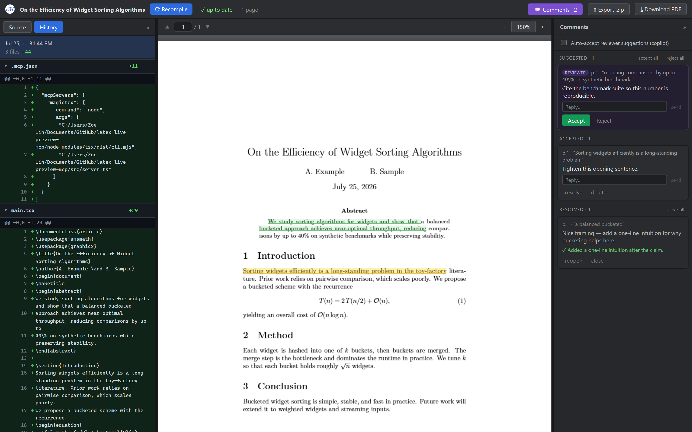

# MagicTeX — Editor LaTeX para agentes de IA

<!-- badges -->
[](https://www.npmjs.com/package/magictex-mcp)
[](https://registry.modelcontextprotocol.io)
[](https://github.com/ZoeLinUTS/MagicTeX-mcp/actions/workflows/ci.yml)
[](https://github.com/ZoeLinUTS/MagicTeX-mcp/stargazers)
[](https://github.com/ZoeLinUTS/MagicTeX-mcp/commits/main)
[](../../LICENSE)
[](https://github.com/sponsors/ZoeLinUTS)

[English](../../README.md) · [简体中文](README.zh-CN.md) · [日本語](README.ja.md) · [한국어](README.ko.md) · [Español](README.es.md) · [Français](README.fr.md) · [Deutsch](README.de.md) · **Português**



**MagicTeX** é um **editor LaTeX feito para agentes de IA** — um espaço de trabalho de **uma
única janela** ao estilo Overleaf para o Claude Code, servido por um servidor MCP, **sem
instalação local de TeX e sem conta Overleaf**: pré-visualização de PDF ao vivo, um editor de
código com **modo Visual (WYSIWYG)**, histórico de alterações e **comentários que você ancora
no PDF renderizado e que se tornam instruções de edição para o agente**. (pacote npm:
`magictex-mcp`.)

Compila com um motor WASM TeX Live 2026
([texlyre-busytex](https://github.com/TeXlyre/texlyre-busytex)) rodando dentro de um navegador
headless, então não há nada de vários GB para instalar — apenas um download único de recursos
WASM.

## Veja antes de instalar

Em **[zoelin.dev/tools/magictex](https://zoelin.dev/tools/magictex)** há um passo a passo
guiado do ciclo comentário → agente, construído com saída real da ferramenta. É um replay,
não uma instância hospedada — o motor TeX é um download único de ~480 MB e a metade do agente
é o próprio Claude, então o MagicTeX roda ao lado do seu projeto, não numa página web.

## O espaço de trabalho

Uma única janela do navegador (inspirada na edição de superfície única do Typst e nas anotações
ancoradas do LiquidText):

- **Ciclo comentário → agente (o essencial).** Revise o documento *renderizado* como quem
  corrige uma prova impressa: selecione texto e adicione um comentário. Depois diga ao Claude
  «address my comments» — ele os obtém via `check_comments` como **tarefas localizadas** (página
  + citação + o `arquivo:linha` de origem + seu pedido), edita a fonte e resolve cada cartão com
  uma nota.
- **Painel de código editável + árvore de arquivos.** Editor LaTeX CodeMirror, árvore de
  arquivos ao estilo Overleaf (pastas, novo/renomear/excluir, trocar de arquivo). Ctrl+S
  recompila.
- **Modo Visual (WYSIWYG).** Títulos, negrito, itálico e fórmulas `$…$` e `\begin{equation}` são
  renderizados no lugar; ao passar o cursor, o LaTeX original reaparece para edição.
- **Fluxo de revisão (revisor → aprovação humana → autor).** Um agente revisor/defensor publica
  comentários com `add_comment`; você **aceita/rejeita** (ou ativa o modo copiloto de
  *auto-aceitar*); um ciclo autor resolve os aceitos.
- **Histórico de alterações.** Cada compilação bem-sucedida é salva em uma **ref git oculta**,
  sem tocar em seus branches nem no seu `git log`.

## Configuração

1. Adicione ao `.mcp.json` do seu projeto (veja [`.mcp.json.example`](../../.mcp.json.example)):

   ```json
   {
     "mcpServers": {
       "magictex": { "command": "npx", "args": ["-y", "magictex-mcp"] }
     }
   }
   ```

2. **Reinicie o Claude Code** (ou reconecte com `/mcp`) para carregar o servidor.
3. Peça ao Claude «render a preview of this paper» — na primeira vez ele baixa os recursos WASM
   TeX Live (~480 MB, uma única vez), compila e abre a pré-visualização ao vivo.

## Instalar como plugin do Claude Code (comandos de barra)

Para digitar menos, instale o MagicTeX como plugin — uma instalação te dá o servidor MCP **e**
os comandos de barra:

```
/plugin marketplace add ZoeLinUTS/MagicTeX-mcp
/plugin install magictex
```

- **`/magic-latex`** — compila e abre o espaço de trabalho.
- **`/ai-review [skill]`** — revisa o artigo com uma skill (padrão `academic-paper-revision`;
  qualquer nome funciona) e publica comentários para aceitar/rejeitar.
- **`/address-comments`** — resolve seus comentários aceitos (`/loop 60s /address-comments`).
- ⚡ **`/ultra-agents [skill] [depth]`** — modo totalmente autônomo: revisa, aceita
  automaticamente, corrige, repete, até `depth` rodadas (padrão 2), parando mais
  cedo se uma rodada não encontrar nada novo. Sem aprovação entre rodadas — esse é
  o ponto, e o risco. Acima de `depth = 5` pede confirmação antes de começar.
  Termina com um resumo (o que foi apontado, o que mudou, quais checkpoints
  conferir) — cada rodada continua sendo um checkpoint normal e reversível.

### Um comando por ferramenta

Cada ferramenta MCP também tem um comando com o **mesmo nome**, então você executa qualquer passo digitando o nome da ferramenta. A regra para ensinar: *a ferramenta é `X` → digite `/X`*.

| Digite isto | Executa a ferramenta | O que faz |
| --- | --- | --- |
| `/render_preview` | `render_preview` | Compila o artigo e abre/atualiza a pré-visualização ao vivo. |
| `/check_comments` | `check_comments` | Lista os comentários que você aceitou como instruções (sem editar ainda). |
| `/resolve_comment [id] [nota]` | `resolve_comment` | Marca um comentário como feito após a edição; fica **verde** para sua revisão. |
| `/add_comment ["citação"] [nota]` | `add_comment` | Ancora um comentário num trecho para você aceitar/rejeitar. |
| `/reply_to_comment [id] [texto]` | `reply_to_comment` | Adiciona uma resposta no tópico de um comentário. |
| `/show_diff [checkpoint]` | `show_diff` | Diff visual lado a lado como imagem (mudanças atuais ou um checkpoint). |
| `/list_checkpoints [limit]` | `list_checkpoints` | Checkpoints recentes com seu sha, mais novo primeiro — para passar um ao `/show_diff`. |

Você nunca precisa digitá-los: linguagem natural também funciona (*“renderize uma pré-visualização”*, *“resolva meus comentários”*). Os comandos são só um atalho rápido e fácil de ensinar.

## Tools (ferramentas)

A superfície MCP, para qualquer cliente que fale MCP. (No Claude Code, linguagem natural ou os comandos acima já bastam — estas são as ferramentas por baixo.)

| Ferramenta | Parâmetros | O que faz |
| ---- | ---- | ---- |
| `render_preview` | `mainFile?` · `engine?` (`pdflatex` \| `xelatex` \| `lualatex`, padrão `xelatex`) · `backend?` (`wasm` \| `system` \| `auto`, padrão `auto` — latexmk local se instalado, senão o motor WASM incluído) | Compila o projeto e abre/atualiza o espaço de trabalho ao vivo. Se omitido, o arquivo principal é detectado procurando `\documentclass`. |
| `check_comments` | `includeResolved?` (padrão `false`) | Devolve os comentários aceitos como **tarefas localizadas**: página, citação, o `arquivo:linha` de origem e seu pedido. Sugestões de revisor à espera da sua decisão são informadas, mas não devolvidas como trabalho. |
| `add_comment` | `quote` · `comment` · `role?` (`reviewer` \| `defender`) · `page?` · `accepted?` | Ancora um comentário num trecho. É publicado como **sugestão** aguardando seu Aceitar/Rejeitar, a menos que `accepted` seja ativado — essa flag é justamente o que torna autônomo o modo autônomo. |
| `resolve_comment` | `id` · `note` | Marca um comentário como feito após a edição, com uma linha sobre o que mudou. Fica **verde** no espaço de trabalho, aguardando sua revisão. |
| `reply_to_comment` | `id` · `text` · `role?` (`author` \| `reviewer` \| `defender`) | Adiciona uma resposta no tópico, para resolver uma divergência no comentário em vez de no chat. |
| `show_diff` | `checkpoint?` | Renderiza um diff lado a lado **como imagem**, exibida na conversa. Por padrão as mudanças não commitadas; passe um sha de checkpoint para uma versão salva. |
| `list_checkpoints` | `limit?` (padrão 10, máx. 50) | Checkpoints recentes com seu sha, mais novo primeiro — para achar qual passar ao `show_diff`. |

**Os destaques são construídos *sobre* estas ferramentas, não estão entre elas.** `/magic-latex`, `/ai-review`, `/address-comments` e ⚡ `/ultra-agents` são **comandos do plugin** do Claude Code que orquestram as ferramentas acima — `/ultra-agents` encadeia revisar → aceitar automaticamente → corrigir por quantas rodadas você permitir, e é a razão de `add_comment` ter um parâmetro `accepted`. Não fazem parte da superfície MCP: outro cliente MCP vê apenas estas sete. Veja a seção do plugin acima e [docs/AGENT-LOOP.pt.md](AGENT-LOOP.pt.md).

## Documentação

- [**Guia do usuário**](USER-GUIDE.pt.md) — uso no dia a dia, o laço de comentários, modo Visual,
  a árvore de arquivos, levar seu artigo para o Overleaf, cobertura de pacotes.
- [**O laço do agente**](AGENT-LOOP.pt.md) — comentários como gatilhos, rodar sem intervenção com
  `/loop`, o fluxo revisor → aval → resolvedor, e ⚡ `/ultra-agents`.
- [**Roteiro**](ROADMAP.pt.md) — o que já está pronto para agentes concorrentes e o que ainda falta
  para edição multi-agente de fato paralela.
- [**Arquitetura**](ARCHITECTURE.pt.md) — por que um navegador headless, o que cada módulo faz, o
  fluxo de compilação.

Os quatro estão traduzidos nos mesmos 8 idiomas deste README — cada página tem seu próprio
seletor de idioma no topo.

## Patrocine este projeto

O MagicTeX é livre e de código aberto (AGPL-3.0). Se ele economiza seu tempo com os artigos,
considere **[patrocinar o projeto](https://github.com/sponsors/ZoeLinUTS)**. Uma ⭐ no
repositório também ajuda.

## Agradecimentos

MagicTeX é escrito e mantido por [Zoe Lin](https://zoelin.dev), construído com **[Claude Code](https://claude.com/claude-code)**.

Obrigada a **David Turnbull**, que me contou a história de Knuth passando dez anos
construindo o próprio tipógrafo em vez de aceitar a aparência do seu livro — a
história com a qual este projeto segue discutindo. E aos mantenedores do [`texlyre-busytex`](https://github.com/TeXlyre/texlyre-busytex), sem
cujo TeX Live em WASM nada disso rodaria localmente.

## Licença

[AGPL-3.0-or-later](../../LICENSE) — igual ao motor `texlyre-busytex` sobre o qual é construído.
Veja [`THIRD_PARTY_NOTICES.md`](../../THIRD_PARTY_NOTICES.md).
