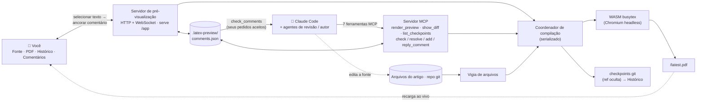

# MagicTeX — Editor LaTeX para agentes de IA

<!-- badges -->
[](https://www.npmjs.com/package/magictex-mcp)
[](https://registry.modelcontextprotocol.io)
[](https://github.com/ZoeLinUTS/MagicTeX-mcp/actions/workflows/ci.yml)
[](https://github.com/ZoeLinUTS/MagicTeX-mcp/stargazers)
[](https://github.com/ZoeLinUTS/MagicTeX-mcp/commits/main)
[](../../LICENSE)
[](https://github.com/sponsors/ZoeLinUTS)

[English](../../README.md) · [简体中文](README.zh-CN.md) · [日本語](README.ja.md) · [한국어](README.ko.md) · [Español](README.es.md) · [Français](README.fr.md) · [Deutsch](README.de.md) · **Português**


**MagicTeX** é um **editor LaTeX feito para agentes de IA** — um espaço de trabalho de **uma
única janela** ao estilo Overleaf para o Claude Code, servido por um servidor MCP, **sem
instalação local de TeX e sem conta Overleaf**: pré-visualização de PDF ao vivo, um editor de
código com **modo Visual (WYSIWYG)**, histórico de alterações e **comentários que você ancora
no PDF renderizado e que se tornam instruções de edição para o agente**. (pacote npm:
`magictex-mcp`.)

Compila com um motor WASM TeX Live 2026
([texlyre-busytex](https://github.com/TeXlyre/texlyre-busytex)) rodando dentro de um navegador
headless, então não há nada de vários GB para instalar — apenas um download único de recursos
WASM.

## Veja antes de instalar

Em **[zoelin.dev/tools/magictex](https://zoelin.dev/tools/magictex)** há um passo a passo
guiado do ciclo comentário → agente, construído com saída real da ferramenta. É um replay,
não uma instância hospedada — o motor TeX é um download único de ~650 MB e a metade do agente
é o próprio Claude, então o MagicTeX roda ao lado do seu projeto, não numa página web.

## O espaço de trabalho

Uma única janela do navegador (inspirada na edição de superfície única do Typst e nas anotações
ancoradas do LiquidText):

```
┌──────────────────────────────────────────────────────────────┐
│  ✓ em dia · 13 páginas          Exportar .zip · Baixar PDF   │
├────────────┬──────────────────────────────┬──────────────────┤
│ Fonte /    │         PDF (ao vivo)        │   Comentários    │
│ Histórico  │  selecione texto → 💬        │  aceitos → peça  │
│  editor,   │  os destaques não saem       │  ao Claude para  │
│  linha do  │  recarrega a cada edição     │  resolver → ✓    │
│  tempo     │                              │                  │
└────────────┴──────────────────────────────┴──────────────────┘
```

- **Ciclo comentário → agente (o essencial).** Revise o documento *renderizado* como quem
  corrige uma prova impressa: selecione texto e adicione um comentário. Depois diga ao Claude
  «address my comments» — ele os obtém via `check_comments` como **tarefas localizadas** (página
  + citação + o `arquivo:linha` de origem + seu pedido), edita a fonte e resolve cada cartão com
  uma nota.
- **Painel de código editável + árvore de arquivos.** Editor LaTeX CodeMirror, árvore de
  arquivos ao estilo Overleaf (pastas, novo/renomear/excluir, trocar de arquivo). Ctrl+S
  recompila.
- **Modo Visual (WYSIWYG).** Títulos, negrito, itálico e fórmulas `$…$` e `\begin{equation}` são
  renderizados no lugar; ao passar o cursor, o LaTeX original reaparece para edição.
- **Fluxo de revisão (revisor → aprovação humana → autor).** Um agente revisor/defensor publica
  comentários com `add_comment`; você **aceita/rejeita** (ou ativa o modo copiloto de
  *auto-aceitar*); um ciclo autor resolve os aceitos.
- **Histórico de alterações.** Cada compilação bem-sucedida é salva em uma **ref git oculta**,
  sem tocar em seus branches nem no seu `git log`.
- **Salvar e recompilar são coisas distintas.** O editor embutido salva sozinho a cada 30 s sem
  recompilar; **Ctrl+S / Salvar / Recompilar** refazem o PDF quando você quiser. (Ative
  **⚡ Live** para recompilar enquanto digita.) Seu próprio editor e as edições do Claude
  continuam recompilando sozinhos pelo vigia de arquivos.
- **Recarga ao vivo.** Um vigia de arquivos recompila a cada gravação — seja edição do Claude,
  do editor embutido ou do seu editor externo.
- **Chegar ao Overleaf.** **Baixar PDF**, **Exportar .zip** (só as entradas de compilação) e um
  link **Open in Overleaf** de um clique para repositórios GitHub públicos; a sincronização pela
  ponte Git do Premium é um `git push` documentado. Veja
  [`USER-GUIDE.pt.md`](USER-GUIDE.pt.md).
- **Projetos reais.** Detecta o arquivo principal, reúne `\input`/`\include` em vários arquivos,
  `.bib`, `.cls`/`.sty`/`.bst` do repositório e figuras, roda BibTeX e repete quando preciso;
  pacotes que costumam faltar são acrescentados automaticamente.
- **Backend de compilação.** Usa seu **latexmk** local se houver — fidelidade total de pacotes,
  saída igual à do Overleaf — e o **WASM** TeX Live embutido, sem instalar nada, se não houver.
  Force com `backend: "system"` / `"wasm"`. Cada compilação informa qual rodou.
- **Classes de documento.** `IEEEtran` vem embutida, porque nenhuma classe de conferência existe
  no WASM TeX Live e uma classe ausente não dá para contornar como um pacote. Os modelos de
  conferência (NeurIPS, ICML, CVPR, ACL, AAAI …) não têm licença redistribuível, então coloque o
  `.cls` do kit do autor ao lado da sua fonte — ele é detectado sozinho.
- **Ferramentas MCP:** `render_preview` (compilar e abrir o espaço de trabalho),
  `check_comments` / `resolve_comment` / `add_comment` / `reply_to_comment` (o ciclo de revisão),
  `show_diff` (diff lado a lado como imagem — útil em clientes que aceitam imagens).
- **Erros acionáveis.** Compilações que falham devolvem erros `{file, line, message}` já
  analisados, para o Claude se corrigir, e aparecem no espaço de trabalho.

## Configuração

O MagicTeX está no npm como [`magictex-mcp`](https://www.npmjs.com/package/magictex-mcp) e
consta no [registro MCP oficial](https://registry.modelcontextprotocol.io) como
**`io.github.ZoeLinUTS/magictex`** — qualquer cliente que leia o registro consegue encontrá-lo.
Não há nada para clonar nem TeX para instalar; o `npx` baixa na primeira vez.

1. Adicione ao `.mcp.json` do seu projeto (veja [`.mcp.json.example`](../../.mcp.json.example)):

   ```json
   {
     "mcpServers": {
       "magictex": { "command": "npx", "args": ["-y", "magictex-mcp"] }
     }
   }
   ```

2. **Reinicie o Claude Code** (ou reconecte com `/mcp`) para carregar o servidor.
3. Peça ao Claude «render a preview of this paper» — na primeira vez ele baixa os recursos WASM
   TeX Live (~650 MB, uma única vez), compila e abre a pré-visualização ao vivo. As edições
   seguintes a recarregam sozinhas.

   Para desenvolvimento local a partir de um clone, aponte para a fonte:
   `"command": "npx", "args": ["tsx", "/caminho/absoluto/magictex-mcp/src/server.ts"]`

Os recursos WASM **não** estão neste repositório. Eles são baixados na primeira execução para um
cache **por usuário** — `~/Library/Caches/magictex` no macOS, `$XDG_CACHE_HOME/magictex` no
Linux, `%LOCALAPPDATA%\magictex` no Windows — de modo que atualizar o MagicTeX não os baixa de
novo, e um clone, uma instalação global e uma execução com `npx` compartilham uma única cópia.
Use `MAGICTEX_ASSETS_DIR` para colocá-los em outro lugar. Para pré-baixar:
`npx texlyre-busytex download-assets <esse diretório>`.

## Instalar como plugin do Claude Code (comandos de barra)

Para digitar menos, instale o MagicTeX como plugin — uma instalação te dá o servidor MCP **e**
os comandos de barra:

```
/plugin marketplace add ZoeLinUTS/MagicTeX-mcp
/plugin install magictex
```

- **`/magic-latex`** — compila e abre o espaço de trabalho.
- **`/ai-review [skill]`** — revisa o artigo com uma skill (padrão `academic-paper-revision`;
  qualquer nome funciona) e publica comentários para aceitar/rejeitar.
- **`/address-comments`** — resolve seus comentários aceitos (`/loop 60s /address-comments`).
- ⚡ **`/ultra-agents [skill] [depth]`** — modo totalmente autônomo: revisa, aceita
  automaticamente, corrige, repete, até `depth` rodadas (padrão 2), parando mais
  cedo se uma rodada não encontrar nada novo. Sem aprovação entre rodadas — esse é
  o ponto, e o risco. Acima de `depth = 5` pede confirmação antes de começar.
  Termina com um resumo (o que foi apontado, o que mudou, quais checkpoints
  conferir) — cada rodada continua sendo um checkpoint normal e reversível.

### Um comando por ferramenta

Cada ferramenta MCP também tem um comando com o **mesmo nome**, então você executa qualquer passo digitando o nome da ferramenta. A regra para ensinar: *a ferramenta é `X` → digite `/X`*.

| Digite isto | Executa a ferramenta | O que faz |
| --- | --- | --- |
| `/render_preview` | `render_preview` | Compila o artigo e abre/atualiza a pré-visualização ao vivo. |
| `/check_comments` | `check_comments` | Lista os comentários que você aceitou como instruções (sem editar ainda). |
| `/resolve_comment [id] [nota]` | `resolve_comment` | Marca um comentário como feito após a edição; fica **verde** para sua revisão. |
| `/add_comment ["citação"] [nota]` | `add_comment` | Ancora um comentário num trecho para você aceitar/rejeitar. |
| `/reply_to_comment [id] [texto]` | `reply_to_comment` | Adiciona uma resposta no tópico de um comentário. |
| `/show_diff [checkpoint]` | `show_diff` | Diff visual lado a lado como imagem (mudanças atuais ou um checkpoint). |
| `/list_checkpoints [limit]` | `list_checkpoints` | Checkpoints recentes com seu sha, mais novo primeiro — para passar um ao `/show_diff`. |

Você nunca precisa digitá-los: linguagem natural também funciona (*“renderize uma pré-visualização”*, *“resolva meus comentários”*). Os comandos são só um atalho rápido e fácil de ensinar.

> O plugin já traz o servidor MCP (`npx magictex-mcp`), então instalar o plugin é tudo o que
> você precisa — o `.mcp.json` acima é a alternativa se preferir não instalar um plugin. Os
> comandos de barra funcionam dos dois jeitos.

## Tools (ferramentas)

A superfície MCP, para qualquer cliente que fale MCP. (No Claude Code, linguagem natural ou os comandos acima já bastam — estas são as ferramentas por baixo.)

| Ferramenta | Parâmetros | O que faz |
| ---- | ---- | ---- |
| `render_preview` | `mainFile?` · `engine?` (`pdflatex` \| `xelatex` \| `lualatex`, padrão `xelatex`) · `backend?` (`wasm` \| `system` \| `auto`, padrão `auto` — latexmk local se instalado, senão o motor WASM incluído) | Compila o projeto e abre/atualiza o espaço de trabalho ao vivo. Se omitido, o arquivo principal é detectado procurando `\documentclass`. |
| `check_comments` | `includeResolved?` (padrão `false`) | Devolve os comentários aceitos como **tarefas localizadas**: página, citação, o `arquivo:linha` de origem e seu pedido. Sugestões de revisor à espera da sua decisão são informadas, mas não devolvidas como trabalho. |
| `add_comment` | `quote` · `comment` · `role?` (`reviewer` \| `defender`) · `page?` · `accepted?` | Ancora um comentário num trecho. É publicado como **sugestão** aguardando seu Aceitar/Rejeitar, a menos que `accepted` seja ativado — essa flag é justamente o que torna autônomo o modo autônomo. |
| `resolve_comment` | `id` · `note` | Marca um comentário como feito após a edição, com uma linha sobre o que mudou. Fica **verde** no espaço de trabalho, aguardando sua revisão. |
| `reply_to_comment` | `id` · `text` · `role?` (`author` \| `reviewer` \| `defender`) | Adiciona uma resposta no tópico, para resolver uma divergência no comentário em vez de no chat. |
| `show_diff` | `checkpoint?` | Renderiza um diff lado a lado **como imagem**, exibida na conversa. Por padrão as mudanças não commitadas; passe um sha de checkpoint para uma versão salva. |
| `list_checkpoints` | `limit?` (padrão 10, máx. 50) | Checkpoints recentes com seu sha, mais novo primeiro — para achar qual passar ao `show_diff`. |

**Os destaques são construídos *sobre* estas ferramentas, não estão entre elas.** `/magic-latex`, `/ai-review`, `/address-comments` e ⚡ `/ultra-agents` são **comandos do plugin** do Claude Code que orquestram as ferramentas acima — `/ultra-agents` encadeia revisar → aceitar automaticamente → corrigir por quantas rodadas você permitir, e é a razão de `add_comment` ter um parâmetro `accepted`. Não fazem parte da superfície MCP: outro cliente MCP vê apenas estas sete. Veja a seção do plugin acima e [docs/AGENT-LOOP.pt.md](AGENT-LOOP.pt.md).

## Como fica no terminal

Isto é saída real das ferramentas, copiada literalmente de uma execução contra o artigo de
exemplo — nada é encenado. É o que você vê no Claude Code enquanto o espaço de trabalho do
navegador (a captura acima) reflete o mesmo estado ao vivo.

Você digita:
```
/magic-latex
```
O Claude chama `render_preview` e responde:
```
✓ Compiled main.tex with xelatex in 1900ms — 2 files. Workspace (live preview,
source editor, history, PDF comments — auto-reloads on edits):
http://127.0.0.1:52042/app
```

Você (ou uma skill revisora) deixa um comentário e depois pergunta o que está pronto para
resolver. O Claude chama `check_comments`:
```
1 accepted comment — edit each at its source location per the instruction, then
call resolve_comment with its id and a one-line note:

[id: 2fce9e3c8b5f] p.1 — "Sorting widgets efficiently is a long-standing problem"
  ↳ source: main.tex:15
  → Tighten this opening sentence.

(1 reviewer suggestion still awaits the human's accept in the workspace — not
actionable yet.)
```
O Claude faz a edição e chama `resolve_comment`:
```
✓ Resolved comment 2fce9e3c8b5f ("Sorting widgets efficiently is a long-standing
problem…") — the card now shows: Rewrote the opening sentence.
```
Pergunte de novo e a fila de aceitos está vazia — resta só a sugestão ainda não aceita,
esperando por você:
```
No accepted comments. (2 already resolved.)

(1 reviewer suggestion still awaits the human's accept in the workspace — not
actionable yet.)
```

## Como funciona

```
Claude edita .tex ─┐
 vigia ────────────┼─▶ coordenador ─▶ Chromium headless ─▶ WASM TeX ─▶ PDF
 render_preview ───┘   (serializado)   (host do motor)                │
                                                                      ▼
       seu espaço de trabalho (/app)  ◀── WebSocket "reload" ◀── servidor HTTP local
       Fonte · PDF · Histórico · Comentários     (serve /app e /latest.pdf)
```

Os motores WASM precisam dos globais DOM/Worker, então o servidor hospeda um Chromium headless
oculto como seu trabalhador de compilação; o espaço de trabalho que *você* abre é um app React +
pdf.js leve, sem nenhum WASM dentro. Veja [`ARCHITECTURE.pt.md`](ARCHITECTURE.pt.md).



As duas portas de entrada — você no espaço de trabalho e os agentes pelas 7 ferramentas MCP —
se encontram no mesmo coordenador, no mesmo armazenamento de comentários e no mesmo histórico
git. Você age sobre o *documento renderizado* (ancora um comentário); o Claude age sobre a
*fonte* (lê seus comentários via `check_comments`, edita, `resolve_comment`). É esse substrato
compartilhado que torna possíveis o ciclo de comentários, o fluxo de revisão e um histórico
rastreável.

## Requisitos

- Node 20.19+ (o piso que `chokidar` e `playwright` realmente precisam; o servidor verifica ao
  iniciar e, se não atender, diz isso claramente e se recusa a iniciar, em vez de lançar um erro
  que nem menciona o Node)
- O Chromium do Playwright (instalado automaticamente; ~150–300 MB) — ou configure para
  reutilizar o Chrome que você já tem.
- ~650 MB de disco para os recursos WASM TeX Live de uma única vez — tudo é baixado na primeira
  execução, em três conjuntos de pacotes (basic 87 MB, recommended 190 MB, extra 324 MB, mais os
  31 MB do motor). Um artigo normal só *carrega* o conjunto basic; os outros dois ficam no disco
  até algo precisar deles. O cache é por usuário, não por instalação, então atualizar o MagicTeX
  não os baixa de novo. Mude o local com `MAGICTEX_ASSETS_DIR`.
- **Uma distribuição TeX local é opcional.** Abaixo, quando ela importa.

### Preciso de uma distribuição TeX local?

Não — o motor WASM incluído compila sem instalar nada, e é justamente esse o
objetivo. Mas ele traz um *subconjunto* do TeX Live: faltam `svg`, a maioria das
classes de conferência e vários pacotes menos comuns. Quando falta algum, você é
avisada, em vez de receber um PDF silenciosamente errado.

Instale uma distribuição quando quiser uma saída idêntica à do Overleaf. O
MagicTeX a detecta sozinho, sem configuração:

| | |
|---|---|
| macOS | [MacTeX](https://tug.org/mactex/) |
| Linux | `texlive-full` |
| Windows | [TeX Live](https://tug.org/texlive/) |

> `latexmk` é o que o MagicTeX procura no `PATH`, mas não se instala
> separadamente: é um script que vem dentro das distribuições acima. Confirme com
> `which latexmk`; no macOS pode ser preciso antes
> `eval "$(/usr/libexec/path_helper)"` ou um terminal novo.

Cada compilação diz qual rodou — `xelatex · system` ou `xelatex · wasm`.

## Desenvolvimento

```bash
npm install
npm run typecheck    # tsc para o servidor e para a UI
npm run build:ui     # compila o espaço de trabalho React em ui/dist
npm test             # a suíte unitária — sem motor, sem navegador, segundos
npm start            # roda o servidor em stdio (para um cliente MCP manual)
```

Dois níveis, de propósito. `npm test` cobre o armazenamento de comentários, a ancoragem por
texto, a geometria de linhas e colunas, o repositório de histórico, os caminhos dos recursos, a
classificação do log de compilação, o encerramento do servidor de pré-visualização e um E2E do
fluxo MCP — tudo sem navegador nem motor TeX, então é rápido e determinístico. A CI
(`.github/workflows/ci.yml`) roda typecheck + build da UI + essa suíte no Node 20 e 22 a cada
push e a cada pull request.

O que um teste unitário **estruturalmente não consegue ver** — a geometria dos destaques em
vários níveis de zoom, o que uma renderização com falha realmente diz ao leitor, se ao encerrar
o servidor fecha mesmo e avisa as janelas abertas — vive em `scripts/smoke-*.mjs` e roda contra
um navegador real e uma compilação real em `.github/workflows/smoke-macos.yml`. Cada um deles
existe porque **algo foi publicado quebrado com a suíte unitária no verde**. Mantenha os dois no
verde e acrescente cobertura junto com as mudanças.

## Documentação

- [**Guia do usuário**](USER-GUIDE.pt.md) — uso no dia a dia, o laço de comentários, modo Visual,
  a árvore de arquivos, levar seu artigo para o Overleaf, cobertura de pacotes.
- [**O laço do agente**](AGENT-LOOP.pt.md) — comentários como gatilhos, rodar sem intervenção com
  `/loop`, o fluxo revisor → aval → resolvedor, e ⚡ `/ultra-agents`.
- [**Roteiro**](ROADMAP.pt.md) — o que já está pronto para agentes concorrentes e o que ainda falta
  para edição multi-agente de fato paralela.
- [**Arquitetura**](ARCHITECTURE.pt.md) — por que um navegador headless, o que cada módulo faz, o
  fluxo de compilação.

Os quatro estão traduzidos nos mesmos 8 idiomas deste README — cada página tem seu próprio
seletor de idioma no topo.

## Roteiro

Várias sessões do Claude Code já conseguem trabalhar no mesmo projeto ao mesmo tempo sem
corromper os comentários nem o histórico de checkpoints (veja
[`ROADMAP.pt.md`](ROADMAP.pt.md)) — a edição multiagente de fato paralela (revisor / autor /
defensor em seus próprios branches git, depois mesclados) é o próximo marco.

## Patrocine este projeto

O MagicTeX é livre e de código aberto (AGPL-3.0). Se ele economiza seu tempo com os artigos,
considere **[patrocinar o projeto](https://github.com/sponsors/ZoeLinUTS)**. Uma ⭐ no
repositório também ajuda.

## Agradecimentos

MagicTeX é escrito e mantido por [Zoe Lin](https://zoelin.dev), construído com **[Claude Code](https://claude.com/claude-code)**.

Obrigada a **David Turnbull**, que me contou a história de Knuth passando dez anos
construindo o próprio tipógrafo em vez de aceitar a aparência do seu livro — a
história com a qual este projeto segue discutindo. E aos mantenedores do [`texlyre-busytex`](https://github.com/TeXlyre/texlyre-busytex), sem
cujo TeX Live em WASM nada disso rodaria localmente.

## Licença

[AGPL-3.0-or-later](../../LICENSE) — igual ao motor `texlyre-busytex` sobre o qual é construído.
Veja [`THIRD_PARTY_NOTICES.md`](../../THIRD_PARTY_NOTICES.md).
