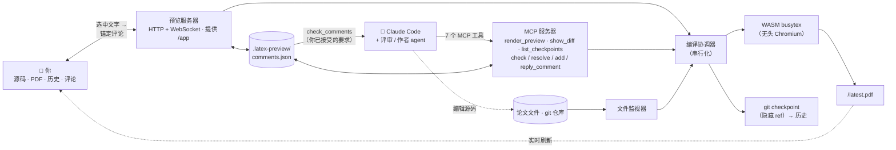

# MagicTeX — 面向 AI Agent 的 LaTeX 编辑器

<!-- badges -->
[](https://www.npmjs.com/package/magictex-mcp)
[](https://registry.modelcontextprotocol.io)
[](https://github.com/ZoeLinUTS/MagicTeX-mcp/actions/workflows/ci.yml)
[](https://github.com/ZoeLinUTS/MagicTeX-mcp/stargazers)
[](https://github.com/ZoeLinUTS/MagicTeX-mcp/commits/main)
[](../../LICENSE)
[](https://github.com/sponsors/ZoeLinUTS)

[English](../../README.md) · **简体中文** · [日本語](README.ja.md) · [한국어](README.ko.md) · [Español](README.es.md) · [Français](README.fr.md) · [Deutsch](README.de.md) · [Português](README.pt.md)


**MagicTeX** 是一个**为 AI Agent 打造的 LaTeX 编辑器**——一个类 Overleaf 的
**单窗口工作区**，通过 MCP 服务器接入 Claude Code，**无需本地安装 TeX，也无需
Overleaf 账号**：实时 PDF 预览、带**可视化（所见即所得）模式**的源码编辑器、修改历史，
以及**你在渲染后的 PDF 上锚定的评论——它们会直接变成 Agent 的修改指令**。（npm 包名：
`magictex-mcp`。）

它用运行在无头浏览器里的 WASM TeX Live 2026 引擎
（[texlyre-busytex](https://github.com/TeXlyre/texlyre-busytex)）编译，因此没有几个 GB
的东西要装——只有一次性的 WASM 资源下载。

## 安装前先看一眼

**[zoelin.dev/tools/magictex](https://zoelin.dev/tools/magictex)** 上有一个「评论 → agent」
闭环的分步演示，全部内容取自真实工具输出。它是回放，不是在线实例——TeX 引擎需要一次性下载
约 650 MB，而 agent 那一半就是 Claude 本身，所以 MagicTeX 运行在你的项目旁边，而不是网页里。

## 工作区

一个浏览器窗口（灵感来自 Typst 的单界面编辑与 LiquidText 的锚定批注）：

```
┌──────────────────────────────────────────────────────────────┐
│  ✓ 已是最新 · 13 页              导出 .zip · 下载 PDF        │
├────────────┬──────────────────────────────┬──────────────────┤
│ 源码 /     │         PDF（实时）          │      评论        │
│ 历史       │  选中文字 → 💬 评论          │  已接受 → 让     │
│  编辑器、  │  高亮始终锚定在原处          │  Claude 去处理   │
│  时间线    │  每次修改自动重新加载        │  → 已解决 ✓      │
│  + diff    │                              │                  │
└────────────┴──────────────────────────────┴──────────────────┘
```

- **评论 → Agent 闭环（核心）。** 像导师批改打印稿一样审阅**渲染后**的文档：选中文字、
  加一条评论（“把这段改简洁”）。然后让 Claude *“address my comments”*——它通过
  `check_comments` 把评论作为**带定位的工作项**（页码 + 引用原文 + 对应的源码 `文件:行号`
  + 你的要求）取走、修改源码、并逐条标记完成。你操作文档，Claude 操作源码。可用 `/loop`
  无人值守地跑。
- **可编辑源码面板 + 文件树。** CodeMirror LaTeX 编辑器，Overleaf 式文件树（文件夹、
  新建/重命名/删除、切换文件）；Ctrl+S 保存即重新编译并刷新 PDF。
- **可视化（所见即所得）模式。** 标题、加粗、斜体、`$…$` 与 `\begin{equation}` 数学公式
  就地渲染；把光标移上去即显示原始 LaTeX 可编辑。
- **审阅工作流（reviewer → 人工确认 → 修改）。** reviewer/defender agent 通过
  `add_comment` 提出评论；你 **Accept/Reject**（或开启 *自动接受* 的 copilot 模式）；
  author 循环去解决已接受的评论。评论带角色与回复线程。
- **修改历史。** 每次成功编译都会自动快照到一个**隐藏的 git ref**，不污染你的分支与
  `git log`；History 标签页展示时间线与彩色 diff。
- **保存与重编译分离。** 内置编辑器每 30 秒自动保存（不重编译）；**Ctrl+S / 保存 /
  Recompile** 才按需重建 PDF。（开启 **⚡ Live** 则边打字边重编译。）你自己的编辑器和
  Claude 的修改仍然经由监视器自动重编译。
- **实时刷新。** 文件监视器在每次保存时重新编译 —— 无论是 Claude 改的、内置编辑器改的，
  还是你用外部编辑器改的。
- **导出到 Overleaf。** **下载 PDF**、**导出 .zip**（干净的构建输入包），以及面向公开
  GitHub 仓库的一键 **Open in Overleaf** 链接；Premium 的 Git bridge 同步是一条写在文档里的
  `git push`。见 [`USER-GUIDE.zh-CN.md`](USER-GUIDE.zh-CN.md)。
- **真实项目。** 自动识别主文件，收集多文件的 `\input`/`\include`、`.bib`、仓库内的
  `.cls`/`.sty`/`.bst` 以及插图，运行 BibTeX 并在需要时重跑；常见的缺失宏包会被自动补上。
- **编译后端。** 本机装了 **latexmk** 就用它 —— 宏包完整、输出与 Overleaf 一致；没装就用
  内置的零安装 **WASM** TeX Live。可用 `backend: "system"` / `"wasm"` 强制指定。每次编译
  都会报告用的是哪一个。
- **文档类。** `IEEEtran` 是内置的 —— 因为 WASM TeX Live 里没有任何会议文档类，而缺一个
  文档类没法像缺一个宏包那样绕过去。会议模板（NeurIPS、ICML、CVPR、ACL、AAAI……）都没有
  可再分发的许可，所以把作者工具包里的 `.cls` 放在源码旁边即可 —— 会被自动识别。
- **MCP 工具：** `render_preview`（编译并打开工作区）、`check_comments` /
  `resolve_comment` / `add_comment` / `reply_to_comment`（评审循环）、`show_diff`
  （并排 diff 图片 —— 在支持图片的客户端里很有用）。
- **可执行的错误。** 编译失败会返回解析好的 `{file, line, message}`，Claude 能据此自我修正，
  同时在工作区里显示。

## 安装

MagicTeX 在 npm 上叫 [`magictex-mcp`](https://www.npmjs.com/package/magictex-mcp)，也已登记在
[官方 MCP registry](https://registry.modelcontextprotocol.io) 里，标识是
**`io.github.ZoeLinUTS/magictex`** —— 任何会读 registry 的客户端都能找到它。没有仓库要克隆，
也不需要装 TeX；`npx` 会在第一次使用时把它取下来。

1. 在你的论文项目的 `.mcp.json` 中加入（见 [`.mcp.json.example`](../../.mcp.json.example)）：

   ```json
   {
     "mcpServers": {
       "magictex": { "command": "npx", "args": ["-y", "magictex-mcp"] }
     }
   }
   ```

2. **重启 Claude Code**（或 `/mcp` 重连）以加载服务器。
3. 让 Claude *“render a preview of this paper”*——首次会下载 WASM TeX Live 资源
   （约 650 MB，一次性），编译并打开实时预览。之后的修改会自动刷新。

   从克隆的仓库做本地开发时，改成指向源码：
   `"command": "npx", "args": ["tsx", "/绝对路径/magictex-mcp/src/server.ts"]`

WASM 资源**不在**这个仓库里。它们在首次运行时被下载到一个**按用户**的缓存目录 ——
macOS 上是 `~/Library/Caches/magictex`，Linux 上是 `$XDG_CACHE_HOME/magictex`，
Windows 上是 `%LOCALAPPDATA%\magictex` —— 所以升级 MagicTeX 不会重新下载，而一份克隆、
一次全局安装和一次 `npx` 运行共用同一份拷贝。用 `MAGICTEX_ASSETS_DIR` 可以放到别处。
想预先下载：`npx texlyre-busytex download-assets <那个目录>`。

## 作为 Claude Code 插件安装（斜杠命令）

想少打字，就把 MagicTeX 装成插件——一次安装即同时获得 MCP 服务器与斜杠命令：

```
/plugin marketplace add ZoeLinUTS/MagicTeX-mcp
/plugin install magictex
```

- **`/magic-latex`** — 编译并打开工作区。
- **`/ai-review [skill]`** — 用某个 skill 审阅论文（默认 `academic-paper-revision`，
  也可传入任意 skill 名）并留下评论供你确认；skill 未安装时会给出安装提示。
- **`/address-comments`** — 解决你已接受的评论（可 `/loop 60s /address-comments`）。
- ⚡ **`/ultra-agents [skill] [depth]`** — 全自动模式：审阅、自动接受、修改、重复，最多
  `depth` 轮（默认 2），某一轮没有新意见就提前停止。轮与轮之间不经过你确认——这既是它
  的意义，也是风险所在。`depth` 超过 5 会先让你确认才开始。跑完给一份总结（提了什么、
  改了什么、对应哪些 checkpoint），每一轮依然是普通的、可撤销的 checkpoint。

### 每个工具一个命令

每个 MCP 工具都有一个**同名**的 slash 命令，任何单步都能用工具名触发。要教别人的规则一句话：**工具叫 `X`，就打 `/X`**。

| 打这个 | 调用工具 | 作用 |
| --- | --- | --- |
| `/render_preview` | `render_preview` | 编译论文，打开/刷新实时预览。 |
| `/check_comments` | `check_comments` | 列出你已接受的评论（作为修改指令，先不改）。 |
| `/resolve_comment [id] [说明]` | `resolve_comment` | 改完后标记完成；评论变**绿**等你复核。 |
| `/add_comment ["引文"] [说明]` | `add_comment` | 把评论锚定到某段文字，供你接受/拒绝。 |
| `/reply_to_comment [id] [内容]` | `reply_to_comment` | 给某条评论追加线程回复。 |
| `/show_diff [checkpoint]` | `show_diff` | 并排可视化 diff（图片；当前改动或某个 checkpoint）。 |
| `/list_checkpoints [limit]` | `list_checkpoints` | 列出最近的 checkpoint 及其 sha（按时间倒序）——找一个传给 `/show_diff`。 |

其实不打命令也行——直接说人话同样有效（“渲染预览”、“处理我的评论”）。命令只是更快、更好教的简写。

> 插件里已经打包了 MCP 服务器（`npx magictex-mcp`），所以装了插件就够了 —— 上面那段
> `.mcp.json` 是「不想装插件」时的替代方案。两种方式下斜杠命令都能用。

## Tools（工具）

面向任何支持 MCP 的客户端的接口层。（在 Claude Code 里直接说人话、或用上面的斜杠命令就行——这些是底层工具。）

| 工具 | 参数 | 作用 |
| ---- | ---- | ---- |
| `render_preview` | `mainFile?` · `engine?`（`pdflatex` \| `xelatex` \| `lualatex`，默认 `xelatex`）· `backend?`（`wasm` \| `system` \| `auto`，默认 `auto` —— 本机装了 latexmk 就用它，否则用内置 WASM 引擎） | 编译项目并打开/刷新实时工作区。省略主文件时扫描 `\documentclass` 自动识别。 |
| `check_comments` | `includeResolved?`（默认 `false`） | 把已接受的评论作为**带位置的工作项**返回——页码、引用原文、对应源码 `文件:行号`、你的要求。等待裁决的 reviewer 建议只会被提示，不作为工作项返回。 |
| `add_comment` | `quote` · `comment` · `role?`（`reviewer` \| `defender`）· `page?` · `accepted?` | 把评论锚定到某段文字上。默认发布为等待你 Accept/Reject 的**建议**；设置 `accepted` 才直接生效——这个标志正是「全自动模式」之所以全自动的开关。 |
| `resolve_comment` | `id` · `note` | 编辑完成后标记评论已处理，并用一句话说明改了什么。它在工作区里变**绿**，等你复核。 |
| `reply_to_comment` | `id` · `text` · `role?`（`author` \| `reviewer` \| `defender`） | 在评论下追加回复，让分歧在评论里解决，而不是散落在聊天记录中。 |
| `show_diff` | `checkpoint?` | 把并排 diff 渲染成**图片**，直接显示在对话里。默认是当前未提交的改动；传 checkpoint sha 可看某个存档版本。 |
| `list_checkpoints` | `limit?`（默认 10，最大 50） | 列出最近的 checkpoint 及其 sha，最新在前——用它找到要传给 `show_diff` 的那个。 |

**核心卖点建立在这些工具之上，而不在这张表里。** `/magic-latex`、`/ai-review`、`/address-comments` 和 ⚡ `/ultra-agents` 是 Claude Code 的**插件命令**，负责编排上面这些工具——`/ultra-agents` 会把「评审 → 自动接受 → 修复」串成循环，跑满你允许的轮数，`add_comment` 的 `accepted` 参数正是为它而设。它们不属于 MCP 接口层，所以其他 MCP 客户端只会看到这 7 个工具。详见上面的插件小节和 [docs/AGENT-LOOP.zh-CN.md](AGENT-LOOP.zh-CN.md)。

## 在终端里长什么样

下面是真实的工具输出，逐字截取自对示例论文的一次实际运行，没有编造。你在 Claude Code
里看到的就是这些，而浏览器工作区（上面那张截图）同时实时反映同一状态。

你输入：
```
/magic-latex
```
Claude 调用 `render_preview`，回复：
```
✓ Compiled main.tex with xelatex in 1900ms — 2 files. Workspace (live preview,
source editor, history, PDF comments — auto-reloads on edits):
http://127.0.0.1:52042/app
```

你（或某个 reviewer skill）留下一条评论，然后问「现在有什么可以动手的」。Claude 调用
`check_comments`：
```
1 accepted comment — edit each at its source location per the instruction, then
call resolve_comment with its id and a one-line note:

[id: 2fce9e3c8b5f] p.1 — "Sorting widgets efficiently is a long-standing problem"
  ↳ source: main.tex:15
  → Tighten this opening sentence.

(1 reviewer suggestion still awaits the human's accept in the workspace — not
actionable yet.)
```
Claude 改完，调用 `resolve_comment`：
```
✓ Resolved comment 2fce9e3c8b5f ("Sorting widgets efficiently is a long-standing
problem…") — the card now shows: Rewrote the opening sentence.
```
再问一次，已接受的队列就空了 —— 只剩那条还没被你接受的建议，在等你：
```
No accepted comments. (2 already resolved.)

(1 reviewer suggestion still awaits the human's accept in the workspace — not
actionable yet.)
```

## 它是怎么工作的

```
Claude 编辑 .tex ─┐
 文件监视器 ───────┼─▶ 编译协调器 ─▶ 无头 Chromium ─▶ WASM TeX ─▶ PDF
 render_preview ──┘    （串行化）      （引擎宿主）                 │
                                                                    ▼
              你的工作区 (/app)  ◀── WebSocket "reload" ◀── 本地 HTTP 服务器
              源码 · PDF · 历史 · 评论            （提供 /app 和 /latest.pdf）
```

WASM 引擎需要 DOM/Worker 全局对象，所以服务器藏了一个无头 Chromium 当编译工人；
而*你*打开的那个工作区是轻量的 React + pdf.js 应用，里面没有任何 WASM。
详见 [`ARCHITECTURE.zh-CN.md`](ARCHITECTURE.zh-CN.md)。



两扇前门 —— 你在工作区里，agent 通过那 7 个 MCP 工具 —— 汇合在同一个协调器、同一个
评论存储、同一份 git 历史上。你操作的是*渲染出来的文档*（锚定一条评论）；Claude 操作的
是*源码*（用 `check_comments` 读你的评论、编辑、`resolve_comment`）。正是这层共享的底座，
让评论循环、评审工作流和可追溯的历史成为可能。

## 运行要求

- Node 20.19+（`chokidar` 和 `playwright` 实际需要的下限；服务器启动时会检查，
  不满足就明确告诉你并拒绝启动，而不是抛一个跟 Node 无关的错）
- Playwright 的 Chromium（自动安装，约 150–300 MB）—— 也可以配置成复用你已装的 Chrome。
- 约 650 MB 磁盘用于一次性的 WASM TeX Live 资源 —— 首次运行全部下载，分三个包集
  （basic 87 MB、recommended 190 MB、extra 324 MB，外加 31 MB 引擎）。普通论文只会
  *加载* basic 那一份，另外两个躺在磁盘上直到有东西需要它们。按用户缓存而不是按安装缓存，
  所以升级 MagicTeX 不会重新下载。用 `MAGICTEX_ASSETS_DIR` 可以改位置。
- **本机 TeX 发行版是可选的。** 什么时候有必要，见下。

### 我需要本机装 TeX 吗？

不需要 —— 内置的 WASM 引擎不装任何东西就能编译，这正是它的意义。但它只是 TeX Live
的一个*子集*：`svg`、大多数会议文档类，以及一些不那么常见的宏包都不在里面。缺了
的时候会明确告诉你，而不是默默给你一份错的 PDF。

当你需要和 Overleaf 完全一致的输出时再装。MagicTeX 会自动发现并使用它，无需配置：

| | |
|---|---|
| macOS | [MacTeX](https://tug.org/mactex/) |
| Linux | `texlive-full` |
| Windows | [TeX Live](https://tug.org/texlive/) |

> MagicTeX 在 `PATH` 上找的是 `latexmk`，但它**不是一个可以单独安装的东西** ——
> 它是上面这些发行版自带的驱动脚本。装完用 `which latexmk` 确认；macOS 上可能要
> 先跑 `eval "$(/usr/libexec/path_helper)"` 或者重开一个终端。

每次编译都会说明用的是哪个 —— `xelatex · system` 还是 `xelatex · wasm`。

## 开发

```bash
npm install
npm run typecheck    # 对服务器和 UI 分别跑 tsc
npm run build:ui     # 把 React 工作区构建到 ui/dist
npm test             # 单元测试 —— 不需要引擎、不需要浏览器，几秒钟
npm start            # 在 stdio 上运行服务器（供手动的 MCP 客户端连接）
```

刻意分成两层。`npm test` 覆盖评论存储、锚点匹配、行与列的几何计算、历史仓库、资源路径、
编译日志分类、预览服务器的关闭流程，以及一个 MCP 工作流 E2E —— 全都不碰浏览器和 TeX
引擎，所以它快而且稳定。CI（`.github/workflows/ci.yml`）在每次 push 和 PR 上于 Node 20
和 22 跑 typecheck + UI 构建 + 这套测试。

而单元测试**结构上看不见**的那些东西 —— 高亮在各个缩放级别下的几何位置、渲染失败时到底
告诉了读者什么、关闭时有没有真的关掉服务器并提醒还开着的窗口 —— 放在 `scripts/smoke-*.mjs`
里，在 `.github/workflows/smoke-macos.yml` 中对着真实浏览器和真实编译运行。这里面每一个
都是因为**曾经有东西带着全绿的单元测试发布出去然后坏了**才存在的。请让两层都保持绿色，
改动时补上对应的覆盖。

## 文档

- [**用户手册**](USER-GUIDE.zh-CN.md) —— 日常使用、评论循环、可视化模式、文件树、
  把论文导入 Overleaf、宏包覆盖情况。
- [**Agent 循环**](AGENT-LOOP.zh-CN.md) —— 评论作为触发器、用 `/loop` 无人值守运行、
  reviewer → 人工把关 → resolver 工作流,以及 ⚡ `/ultra-agents`。
- [**路线图**](ROADMAP.zh-CN.md) —— 并发 agent 目前已实现了什么,真正的并行 multi-agent
  还差什么。
- [**架构**](ARCHITECTURE.zh-CN.md) —— 为什么用无头浏览器、每个模块干什么、编译流程。

这四篇都翻译成了和本 README 相同的 8 种语言——每页顶部都有自己的语言切换器。

## 路线图

多个 Claude Code 会话现在已经可以并发处理同一个项目，而不会弄坏评论或 checkpoint 历史
（见 [`ROADMAP.zh-CN.md`](ROADMAP.zh-CN.md)）—— 真正的并行 multi-agent 编辑
（reviewer / author / defender 各自在自己的 git 分支上工作，最后合并回来）是下一个里程碑。

## 赞助本项目

MagicTeX 是免费开源的（AGPL-3.0）。如果它为你的论文节省了时间，欢迎
**[赞助本项目](https://github.com/sponsors/ZoeLinUTS)**，这将支持它持续开发。给仓库点个
⭐ 也很有帮助。

## 致谢

MagicTeX 由 [Zoe Lin](https://zoelin.dev) 编写和维护，使用 **[Claude Code](https://claude.com/claude-code)** 开发。

感谢 **David Turnbull**，是他告诉我 Knuth 宁可花十年自己造一套排版系统，也不接受自己
的书排成那样 —— 这个项目至今仍在跟这个故事较劲。也感谢 [`texlyre-busytex`](https://github.com/TeXlyre/texlyre-busytex) 的维护者们，没有那份
WASM 版 TeX Live，这里在本地一行都跑不起来。

## 许可证

[AGPL-3.0-or-later](../../LICENSE)——与其所依赖的 `texlyre-busytex` 引擎保持一致。
详见 [`THIRD_PARTY_NOTICES.md`](../../THIRD_PARTY_NOTICES.md)。
